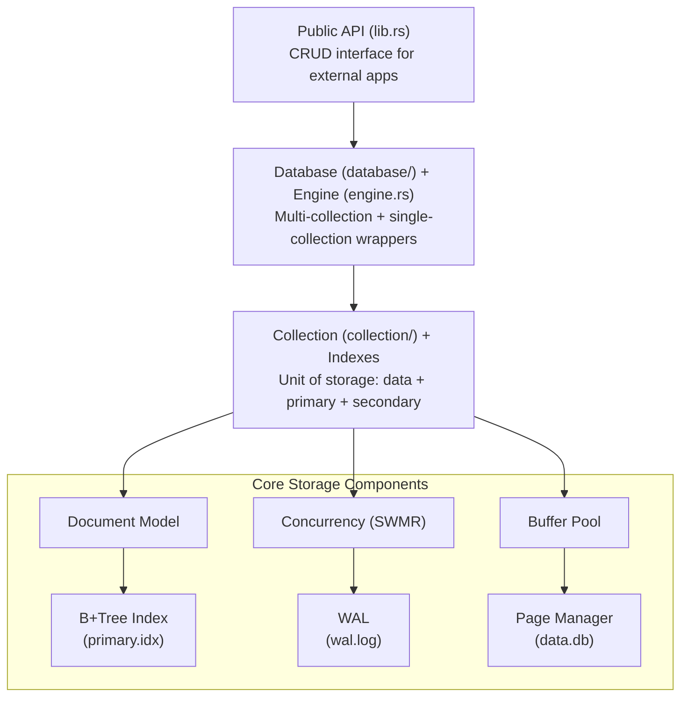

# GrumpyDB — Claude Instructions

## Project

GrumpyDB is a disk-based object storage engine written in Rust. It provides persistent storage of schema-less documents (JSON-like) with B+Tree indexing, page-based storage, WAL for durability, and SWMR concurrency.

## Architecture



### On-disk files

| File          | Role                                      |
|---------------|-------------------------------------------|
| `data.db`     | Page-based document storage                |
| `primary.idx` | B+Tree index (UUID → PageId + SlotId)      |
| `idx_*.idx`   | Secondary indexes (field value + UUID)     |
| `wal.log`     | Write-Ahead Log for crash recovery         |

### Modules

| Module         | Responsibility                                          |
|----------------|---------------------------------------------------------|
| `page`         | 8 KiB pages, slotted layout, overflow, free-list        |
| `btree`        | B+Tree index (fixed UUID keys + variable-length keys), search/insert/delete/split/merge, cursor |
| `wal`          | WAL records, writer, checkpoint, recovery                |
| `buffer`       | Buffer pool LRU, dirty tracking, pin/unpin               |
| `document`     | Value type (JSON-like + Ref), binary codec                |
| `collection`   | Unit of storage: data pages + primary index + secondary indexes, raw CRUD |
| `index`        | Secondary indexes: sortable encoding, SecondaryIndex, IndexDefinition |
| `database`     | Multi-collection management with shared WAL, CRUD routing, reference resolution |
| `naming`       | Name validation: `[a-z0-9_]{1,64}`, reserved names: `_default`, `_system` |
| `concurrency`  | SWMR wrappers: SharedDb (single-collection), SharedDatabase (per-database), SharedServer (multi-tenant) |
| `server`       | Multi-tenant server: GrumpyServer (clients), Client (databases per tenant) |
| `engine`       | Thin wrapper over Collection + WAL, exposes public CRUD  |
| `error`        | Centralized error types (18 variants)                    |

#### External crates

| Crate              | Module              | Responsibility                                          |
|--------------------|---------------------|---------------------------------------------------------|
| `grumpydb-protocol` | `command`          | Command enum with all wire protocol variants, Action/Resource enums for RBAC metadata |
| `grumpydb-protocol` | `response`         | Response enum (Ok, Error, Integer, Bulk, Array), RESP-like serialize/parse |
| `grumpydb-protocol` | `parser`           | `parse_command()` — RESP-like single-line command parser |
| `grumpydb-server`   | `auth::role`       | RoleName, Action, ResourceScope, RoleAssignment, permission checks |
| `grumpydb-server`   | `auth::user`       | User struct, argon2 hash/verify, AuthError              |
| `grumpydb-server`   | `auth::jwt`        | JwtConfig, Claims, generate/verify access & refresh tokens (HS256) |
| `grumpydb-server`   | `auth::store`      | AuthStore: user CRUD, secret.key management, disk persistence |
| `grumpydb-server`   | `session`          | SessionContext: per-connection JWT claims, current_db, RBAC enforcer (authorize) |
| `grumpydb-server`   | `config`           | ServerConfig: bind address, data dir, TLS paths, TOML parsing, CLI args |
| `grumpydb-server`   | `tcp::listener`    | TCP accept loop, TLS via tokio-rustls, self-signed cert generation (rcgen), graceful shutdown |
| `grumpydb-server`   | `tcp::handler`     | Per-connection handler: command parsing, RBAC enforcement, full command executor |
| `grumpydb-server`   | `main`             | Binary entry point: CLI arg parsing, server startup |
| `grumpydb-client`   | `lib`              | GrumpyClient (connect, login, database, raw_execute), DatabaseHandle (CRUD, index, admin API) |
| `grumpydb-client`   | `connection`       | TCP + TLS connection (tokio-rustls), NoCertVerifier for dev, line-based protocol I/O |
| `grumpydb-client`   | `error`            | ClientError enum (Connection, Auth, Protocol, Server, Timeout) |

## Code conventions

### Rust

- **Edition**: 2024
- **Errors**: `thiserror` for definitions, `Result<T, GrumpyError>` everywhere
- **Unsafe**: forbidden unless documented justification (mmap only if decided)
- **Naming**: snake_case for functions/variables, CamelCase for types, UPPER_SNAKE for constants
- **Visibility**: `pub(crate)` by default, `pub` only for the public API in `lib.rs`
- **Documentation**: doc-comments (`///`) on all public API and key internal types
- **Constants**: all magic numbers in `src/page/mod.rs` (PAGE_SIZE, HEADER_SIZE, etc.)

### Tests — MANDATORY

Every `.rs` source file must have a `#[cfg(test)] mod tests` block with unit tests.

- **Unit tests**: in each module, test isolated logic
- **Integration tests**: in `tests/`, test cross-module interactions
- **Minimum coverage** per feature:
  - Happy path
  - Edge cases (full page, overflow, B+Tree node split)
  - Error cases (I/O failure, missing key, corruption)
- **Fixtures**: use `tempfile::TempDir` for tests with disk I/O
- **Naming**: `test_<module>_<expected_behavior>`
- Run tests: `cargo test`
- Run specific test: `cargo test test_name`
- Tests with output: `cargo test -- --nocapture`

### Development workflow

1. **Before coding**: read the relevant skill in `.claude/skills/`
2. **Implement** the feature
3. **Write tests** (unit tests in the same file)
4. **Verify**: `cargo test && cargo clippy -- -D warnings`
5. **Integration tests** if the feature touches multiple modules

### Useful commands

```bash
cargo test                          # All tests
cargo test --lib                    # Unit tests only
cargo test --test '*'               # Integration tests only
cargo clippy -- -D warnings         # Strict lint
cargo fmt --check                   # Check formatting
cargo doc --no-deps --open          # Generate docs
```

## Module dependencies (build order)

```
error (no internal dependencies)
  → page (depends on error)
    → document (depends on error, page for page serialization)
      → btree (depends on error, page, document)
        → wal (depends on error, page)
          → buffer (depends on error, page)
            → index (depends on error, btree, document)
              → collection (depends on error, page, btree, buffer, index)
                → naming (depends on error)
                  → concurrency (depends on error, page, buffer)
                    → database (depends on error, collection, wal, naming)
                      → server (depends on error, database, naming)
                        → concurrency (depends on error, server, database)
                          → engine (depends on collection, wal, concurrency)
                            → lib.rs (exposes engine, database, server, concurrency, index)
```

## Implementation plan

See `docs/IMPLEMENTATION_PLAN.md` for the full phased plan (phases 1–8: storage engine).
See `docs/IMPLEMENTATION_PLAN_V2.md` for the v2 multi-tenant plan (phases 9–15: server, concurrency, shell).
See `docs/IMPLEMENTATION_PLAN_V3.md` for the v3 client interface plan (phases 16–23: protocol, auth, TCP server, drivers).
See `docs/IMPLEMENTATION_PLAN_V4.md` for the v5 hardening + distribution plan (phases 24–43: hardening, observability, architecture cleanup, RS256/JWKS, WAL-shipping replication, MVCC reads).
See `docs/ARCHITECTURE.md` for in-depth technical details.

## Available skills

| Skill | File | When to use |
|-------|------|-------------|
| Page Storage | `.claude/skills/page-storage.md` | Work on page manager, slotted pages, overflow |
| B+Tree Index | `.claude/skills/btree-index.md` | Work on B+Tree index |
| WAL & Recovery | `.claude/skills/wal-recovery.md` | Work on WAL, checkpoint, crash recovery |
| Buffer Pool | `.claude/skills/buffer-pool.md` | Work on LRU cache, dirty tracking |
| Document Model | `.claude/skills/document-model.md` | Work on document model, binary codec |
| Testing Strategy | `.claude/skills/testing-strategy.md` | Writing tests, test strategy |
| Protocol | `.claude/skills/protocol.md` | Work on RESP-like wire protocol (v3) |
| Auth & RBAC | `.claude/skills/auth-rbac.md` | Work on authentication, JWT, roles, permissions (v3) |
| TCP & TLS | `.claude/skills/tcp-tls.md` | Work on TCP server, TLS setup, connection handler (v3) |
| Client Drivers | `.claude/skills/driver.md` | Work on Rust or TypeScript client drivers (v3) |

## Available agents

| Agent | File | Mission |
|-------|------|---------|
| Page Agent | `.claude/agents/page-agent.md` | Develop the page system |
| B+Tree Agent | `.claude/agents/btree-agent.md` | Develop the B+Tree index |
| WAL Agent | `.claude/agents/wal-agent.md` | Develop WAL and recovery |
| Integration Agent | `.claude/agents/integration-agent.md` | Assemble modules and integration testing |
| Docs Agent | `.claude/agents/docs-agent.md` | Verify and update all documentation after each agent |
| Release Agent | `.claude/agents/release-agent.md` | Version bump, git commit/tag, crates.io package after each phase |
| Protocol Agent | `.claude/agents/protocol-agent.md` | Develop the RESP-like wire protocol crate (v3) |
| Auth Agent | `.claude/agents/auth-agent.md` | Develop authentication, JWT, RBAC (v3) |
| TCP Server Agent | `.claude/agents/tcp-server-agent.md` | Develop the async TCP/TLS server (v3) |
| Driver Agent | `.claude/agents/driver-agent.md` | Develop Rust and TypeScript client drivers (v3) |

### Inter-agent workflow

After each execution of a development agent (page, btree, wal, integration, protocol, auth, tcp-server, driver), **always run the Docs Agent** to synchronize documentation with the code, then **run the Release Agent** at each phase completion to bump version and commit.
