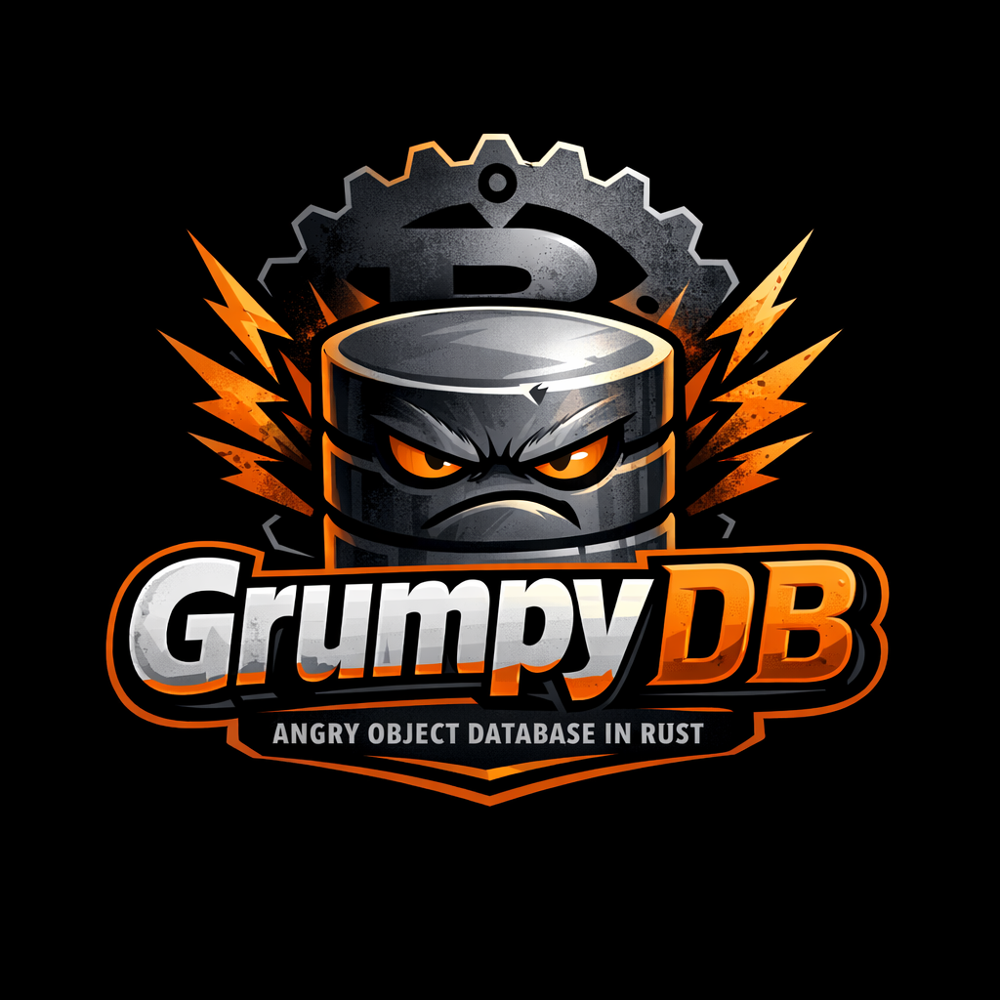

<p align="center">
  
</p>

# GrumpyDB

[](https://github.com/pierreg256/grumpydb/actions/workflows/ci.yml)
[](https://github.com/pierreg256/grumpydb/actions/workflows/fuzz.yml)
[](https://crates.io/crates/grumpydb)
[](https://docs.rs/grumpydb)
[](LICENSE)

**A document-oriented object database written in Rust.**

GrumpyDB stores schema-less JSON-like documents on disk with B+Tree indexing, page-based storage, WAL durability, and multi-tenant isolation. It can be used as an **embedded library** (linked directly into your Rust app) or as a **standalone server** accessed over TCP+TLS with JWT authentication and role-based access control.

---

## Quick Start

### Embedded — no server needed

```bash
cargo run -p grumpy-repl
```

```js
grumpy> use myapp
Switched to database "myapp"

grumpy [myapp]> db.createCollection("users")
Collection "users" created

grumpy [myapp]> db.users.insert({ name: "Alice", age: 30, email: "alice@example.com" })
Inserted: 3df9dde6-...

grumpy [myapp]> db.users.insert({ name: "Bob", age: 25, tags: ["dev", "rust"] })
Inserted: e7f8a9b0-...

grumpy [myapp]> db.users.find()
[
  { "_id": "3df9dde6-...", "name": "Alice", "age": 30, "email": "alice@example.com" },
  { "_id": "e7f8a9b0-...", "name": "Bob", "age": 25, "tags": ["dev", "rust"] }
]

grumpy [myapp]> db.users.createIndex("by_age", "age")
Index "by_age" created on field "age"

grumpy [myapp]> db.users.query("by_age", 30)
[{ "_id": "3df9dde6-...", "name": "Alice", "age": 30 }]

grumpy [myapp]> db.users.find({ age: 25 })
[{ "_id": "e7f8a9b0-...", "name": "Bob", "age": 25 }]
```

### Client/Server — multi-tenant with auth

```bash
# Terminal 1: Start the server (first start requires --bootstrap-password)
cargo build -p grumpydb-server
target/debug/grumpydb-server --data ./data --no-tls \
  --bootstrap-password "change-me-now"

# Terminal 2: Connect with the shell
cargo run -p grumpy-repl -- \
  --host localhost --port 6380 \
  --tenant _system --user admin --password "change-me-now"
```

```js
Connected to GrumpyDB at localhost:6380
Authenticated as admin@_system

grumpy> use myapp
Switched to database "myapp"

grumpy [myapp]> db.users.insert({ name: "Alice", age: 30 })
Inserted: a1b2c3d4-...

grumpy [myapp]> db.users.count()
1
```

---

## Use as a Rust Library

Add GrumpyDB to your `Cargo.toml`:

```toml
[dependencies]
grumpydb = "5"
```

### Single-collection (simple key-value)

```rust
use grumpydb::{Database, Value};
use uuid::Uuid;
use std::collections::BTreeMap;

let mut db = Database::open(std::path::Path::new("./mydb")).unwrap();
db.create_collection("docs").unwrap();

let key = Uuid::new_v4();
let doc = Value::Object(BTreeMap::from([
    ("name".into(), Value::String("Alice".into())),
    ("age".into(), Value::Integer(30)),
]));

db.insert("docs", key, doc).unwrap();
let result = db.get("docs", &key).unwrap();
assert!(result.is_some());
db.close().unwrap();
```

> **Note**: the legacy `GrumpyDb` single-collection wrapper is **deprecated in
> v5** and will be removed in v6. New code should use `Database` (with the
> `_default` collection if a single collection is enough).

### Multi-collection with secondary indexes

```rust
use grumpydb::Database;

let mut db = Database::open(std::path::Path::new("./myapp")).unwrap();
db.create_collection("users").unwrap();
db.create_index("users", "by_email", "email").unwrap();

let key = uuid::Uuid::new_v4();
db.insert("users", key, grumpydb::Value::Object(/* ... */)).unwrap();

// Query by index
let results = db.query("users", "by_email", &grumpydb::Value::String("alice@test.com".into())).unwrap();
db.close().unwrap();
```

### Thread-safe concurrent access

```rust
use grumpydb::SharedDatabase;

let db = SharedDatabase::open(std::path::Path::new("./myapp")).unwrap();

// Clone is cheap (Arc), share across threads
let db2 = db.clone();
std::thread::spawn(move || {
    db2.insert("users", uuid::Uuid::new_v4(), grumpydb::Value::Integer(42)).unwrap();
});

let count = db.document_count("users").unwrap();
```

---

## grumpy-repl

An interactive REPL with JavaScript-like syntax, relaxed JSON (unquoted keys, single quotes, trailing commas), and line editing with history.

```bash
# Embedded (no server)
cargo run -p grumpy-repl
cargo run -p grumpy-repl -- --data ./mydata
cargo run -p grumpy-repl -- --eval "use test; db.users.count()"

# Connected (TCP)
cargo run -p grumpy-repl -- --host localhost --tenant acme --user alice --password s3cr3t
```

### Commands

| Category | Commands |
|----------|----------|
| Database | `use <name>` |
| Collections | `db.createCollection("x")`, `db.dropCollection("x")`, `db.collections()` |
| CRUD | `db.x.insert({...})`, `db.x.get("id")`, `db.x.find()`, `db.x.find({age: 30})`, `db.x.update("id", {...})`, `db.x.delete("id")`, `db.x.count()` |
| Indexes | `db.x.createIndex("name", "field")`, `db.x.query("name", value)`, `db.x.queryRange("name", start, end)`, `db.x.indexes()` |
| References | `$ref("coll", "uuid")`, `db.x.resolve("id")`, `db.x.resolveDeep("id")` |
| Maintenance | `db.x.compact()`, `db.x.stats()`, `db.flush()` |

---

## Server

### Architecture

```
Clients (grumpy-repl, Rust driver, TypeScript driver, nc/telnet)
    │
    │  TCP + TLS 1.3 (rustls)
    │  RESP-like text protocol
    │  JWT authentication
    │
┌───▼──────────────────────────────────────────┐
│              GrumpyDB Server                  │
│  ┌─────────────────────────────────────────┐ │
│  │  TLS · Protocol Parser · RBAC Enforcer  │ │
│  └────────────────┬────────────────────────┘ │
│  ┌────────────────▼────────────────────────┐ │
│  │  Auth Store (argon2 + JWT HS256)        │ │
│  └────────────────┬────────────────────────┘ │
│  ┌────────────────▼────────────────────────┐ │
│  │  Engine: Tenants · Databases ·          │ │
│  │  Collections · B+Tree · WAL · Buffer    │ │
│  └─────────────────────────────────────────┘ │
└──────────────────────────────────────────────┘
```

### Running the server

```bash
cargo build -p grumpydb-server

# Plaintext (dev) — first start REQUIRES --bootstrap-password
target/debug/grumpydb-server --data ./data --no-tls \
  --bootstrap-password "your-strong-password"

# TLS (auto-generates self-signed cert) — first start REQUIRES --bootstrap-password
target/debug/grumpydb-server --data ./data \
  --bootstrap-password "your-strong-password"

# With config file
target/debug/grumpydb-server --config grumpydb.toml \
  --bootstrap-password "your-strong-password"

# Subsequent starts: no --bootstrap-password needed once users exist on disk
target/debug/grumpydb-server --data ./data
```

You can also provide the bootstrap password via the environment variable
`GRUMPYDB_BOOTSTRAP_PASSWORD` instead of the CLI flag.

### First-start bootstrap

On a brand-new data directory, the server creates a single `_system/admin`
user with the password you supplied via `--bootstrap-password` (or
`GRUMPYDB_BOOTSTRAP_PASSWORD`). If you start the server without providing one
on a clean data directory, it refuses to start with
`AuthError::BootstrapRefused` — there is no longer a silent `admin/admin`
default.

The auth secret (`<data_dir>/_auth/secret.key`) is created with mode `0600`
on Unix; existing files with looser permissions are re-tightened with a
warning logged on startup.

### Configuration (`grumpydb.toml`)

```toml
[server]
bind = "0.0.0.0:6380"
max_connections = 1024
data_dir = "./data"

[tls]
enabled = true
# cert_file = "server.crt"    # auto-generated if absent
# key_file  = "server.key"

[auth]
access_token_ttl_secs = 3600      # 1 hour
refresh_token_ttl_secs = 604800   # 7 days
```

### User & tenant management

Connect as server admin via `nc localhost 6380`:

```
LOGIN _system admin <your-bootstrap-password>
TOKEN <jwt>

CREATE TENANT acme
CREATE USER alice@acme s3cr3t
GRANT tenant_admin ON @acme TO alice@acme

LIST TENANTS
LIST USERS @acme
```

### Notation

| Syntax | Meaning |
|--------|---------|
| `alice` | User `alice` in current tenant |
| `alice@acme` | User `alice` in tenant `acme` |
| `mydb` | Database (or collection if `USE` is active) |
| `mydb@acme` | Database in tenant `acme` |
| `users:mydb` | Collection `users` in database `mydb` |
| `users:mydb@acme` | Collection in database in tenant |
| `@acme` | Tenant scope (for GRANT/REVOKE) |

### Consistency and topology protocol (Phase 40f)

The TCP protocol now exposes coordinator and consistency-locking primitives:

- `TOPOLOGY` returns a JSON cluster snapshot for smart clients, with
  canonicalized runtime status merge rules (avoid local self-entry overwrite,
  normalize `unknown`+`last_seen` to `up`, prevent known -> `unknown`
  downgrades, prefer local advertised peer address resolution in order
  `peers(local node)` -> `listen_peer` -> `server.bind`, and avoid replacing a
  known routable peer address with wildcard/loopback hosts
  (`0.0.0.0`, `127.0.0.1`, `::`, `[::]`).
- `READ_CONCERN R=<n>` / `WRITE_CONCERN W=<n>` can prefix data commands.
- Database-level consistency defaults are configurable via:
  - `ALTER DATABASE <db> SET CONSISTENCY READ_CONCERN R=<n> [WRITE_CONCERN W=<n>]`
  - `ALTER DATABASE <db> SET CONSISTENCY WRITE_CONCERN W=<n> [READ_CONCERN R=<n>]`
  - `ALTER DATABASE <db> RESET CONSISTENCY`
  - `SHOW DATABASE <db> CONSISTENCY`
- `PUT_WITH_VC <collection> <uuid> <json> <vector_clock>` is accepted for
  reconciled writes (vector clock validated as JSON).
- In the v6 Phase 46 kickoff, `PUT_WITH_VC` now merges values when both the
  stored value and incoming value are CRDT payloads. Helper-level merge
  coverage is now complete for all CRDT kinds (`GCounter`, `PNCounter`,
  `LwwSet`, `OrSet`, `Mvr`), while full end-to-end sibling/tombstone
  reconciliation remains in progress in Phase 46.
- TCP JSON bridge CRDT envelope: `{"$crdt":{"kind":"GCounter|PNCounter|LwwSet|OrSet|Mvr","payload_b64":"..."}}`.

Consistency resolution precedence for data commands is:
1. Per-request wrapper (`READ_CONCERN` / `WRITE_CONCERN`)
2. Database defaults (from `ALTER DATABASE ... SET CONSISTENCY`)
3. Fallback defaults (`R=1`, `W=1`)

Database defaults are persisted in database metadata and survive restart.

Examples:

```text
ALTER DATABASE appdb SET CONSISTENCY READ_CONCERN R=1 WRITE_CONCERN W=2
SHOW DATABASE appdb CONSISTENCY

READ_CONCERN R=1 GET users 7b6f4f8e-1f73-4d41-8dd9-2f0f2a9b4a11
WRITE_CONCERN W=1 UPDATE users 7b6f4f8e-1f73-4d41-8dd9-2f0f2a9b4a11 {"name":"alice"}

ALTER DATABASE appdb RESET CONSISTENCY
```

In v5, the server is intentionally locked to single-owner consistency
(`N=1`, `R=1`, `W=1`):

- Non-default concerns are rejected with `v5 only supports R=1, W=1`.
- If a request targets a key owned by another node, the server returns
  `forward to <node>@<addr>; not the owner`.
- Single-node caveat: with `N=1`, requesting `R>1` or `W>1` is invalid for
  strict quorum semantics and commands will fail; keep `R=1` and `W=1`.

In current v6 work, static consistency validation accepts bounded concerns
(`R, W ∈ [1, N]`) for data commands. Runtime behavior is functional for keyed
`GET` and secondary-index `QUERY`/`QUERYRANGE` when `R > 1`:

- `GET` performs read-quorum liveness + read-ack checks, fans out value reads
  to remote replicas over the authenticated cluster handshake channel, selects
  a canonical value deterministically, applies local convergence, and attempts
  immediate remote read-repair upserts. Failed immediate repairs are persisted
  as durable `ReadRepairIntent` retries and replayed by a background worker.
- `QUERY`/`QUERYRANGE` run a verified query path: gather candidate UUIDs from
  local index plus replica peers, hydrate candidates through quorum reads,
  re-evaluate the predicate against document fields, and return only validated
  rows.
- Fast path is unchanged for `R=1`: local secondary-index lookup behavior is
  retained.
- Candidate ceiling is `4096` UUIDs for verified query mode; exceeding it
  fails the command with an error instead of returning partial results.

Example:

```text
READ_CONCERN R=2 QUERY users by_email "alice@test.com"
READ_CONCERN R=2 QUERYRANGE users by_age 20 30
```

Phases 48/49 remain partial and are not complete yet:
- Phase 48 partial runtime: durable per-node hinted-handoff JSONL backlog
  store (`grumpydb-server/src/cluster/hints.rs`) now records tenant +
  operation (`upsert`/`delete`) and keeps backward-compatible replay from
  legacy `payload_json` records. Listener startup now spawns a background
  hint worker that lists target backlogs, checks peer liveness via
  coordinator state, drains batches, replays each hint to peers over
  authenticated RPC, re-enqueues failures, and increments replay/retry
  metrics.
- Current keyed write runtime semantics in this path: `WRITE_CONCERN W`
  counts remote apply acknowledgements for `INSERT`, `UPDATE`, `DELETE`, and
  `PUT_WITH_VC` (not only handshake reachability). When quorum is not met
  before `write_ack_timeout_ms`, the command fails, but the local write may
  already be committed; rollback is not attempted. Failed replica deliveries
  are queued to hinted handoff for later replay.
- Peer-applied replicated writes now auto-create missing target
  tenant/database/collection on destination nodes, so replayed upserts/deletes
  do not fail only because the namespace is absent.
- Phase 49 partial runtime: coordinator rebalance preview helpers based on ring
  key-range deltas (`plan_rebalance_add_node`, `plan_rebalance_remove_node`),
  transfer executors (`execute_rebalance_add_node_transfer`,
  `execute_rebalance_remove_node_transfer`), and control-plane command wiring:
  `REBALANCE PLAN ADD-NODE <node_id>`,
  `REBALANCE PLAN REMOVE-NODE <node_id>`,
  `REBALANCE EXECUTE ADD-NODE <node_id> <collection>`,
  `REBALANCE EXECUTE REMOVE-NODE <node_id> <collection>`. PLAN returns JSON
  previews. EXECUTE requires `USE <db>` and runs transfer execution for the
  selected database and provided collection. The remove-node path computes
  ownership before/after `ring.remove_node`, scans local collection data,
  transfers keys whose prior owner was the removed node and whose new owner is
  a live remote peer, tracks considered/transferred/failed/retained-local, and
  updates rebalance metrics.
- Peer data RPC on the handshake channel now supports `GET`, `UPSERT`, and
  `DELETE` operations.
- Missing for completion: broader transfer orchestration and convergence
  validation under churn/concurrent writes.

### RBAC roles

| Role | Permissions |
|------|-------------|
| `server_admin` | Everything (cross-tenant) |
| `tenant_admin` | Manage databases, users, full CRUD within tenant |
| `db_admin` | Manage collections, indexes, CRUD within a database |
| `read_write` | INSERT, GET, UPDATE, DELETE, SCAN, QUERY |
| `read_only` | GET, SCAN, QUERY |

### HTTP endpoints (observability)

The server runs a small HTTP server on a separate port (default
`0.0.0.0:6381`) for orchestrators and Prometheus. **No authentication**
on these endpoints by design — they are meant for k8s probes and
metrics scraping. Set `bind = ""` in the `[http]` section of the config
to disable the HTTP server entirely.

```bash
# Liveness — process is up
curl -s http://localhost:6381/healthz
# (200 OK)

# Readiness — TCP listener has bound
curl -s -o /dev/null -w "%{http_code}\n" http://localhost:6381/readyz
# 200 (or 503 during early startup)

# Prometheus metrics
curl -s http://localhost:6381/metrics | head -20
```

Initial metric catalog (every series is described up-front):
`grumpydb_connections_active`, `grumpydb_commands_total{cmd,result}`,
`grumpydb_command_duration_seconds{cmd}`,
`grumpydb_login_failures_total{reason}`,
`grumpydb_rate_limit_hits_total{kind}`, plus
`grumpydb_buffer_pool_pages{state}` and `grumpydb_wal_records_total`
(described in v5, will start moving once the engine grows the
corresponding hooks).

---

## Client Drivers

### Rust (`grumpydb-client`)

```rust
use grumpydb_client::GrumpyClient;

let mut client = GrumpyClient::connect("localhost", 6380, false).await?;
client.set_jwks_url("http://localhost:6381/.well-known/jwks.json");
client.login("acme", "alice", "s3cr3t").await?;

let db = client.database("myapp").await?;
let key = uuid::Uuid::new_v4();
db.insert("users", key, &serde_json::json!({"name": "Bob"})).await?;
let doc = db.get("users", &key).await?;
```

### TypeScript (`@grumpydb/client`)

```typescript
import { GrumpyClient } from '@grumpydb/client';

const client = await GrumpyClient.connect({
  host: 'localhost', port: 6380, tls: false,
  tenant: 'acme', username: 'alice', password: 's3cr3t',
  jwksUrl: 'http://localhost:6381/.well-known/jwks.json',
});

const db = client.database('myapp');
await db.insert('users', crypto.randomUUID(), { name: 'Bob' });
const doc = await db.get('users', '<uuid>');
await client.close();
```

More TypeScript driver details and examples:
`drivers/typescript/README.md`.

---

## Storage Engine

Under the hood, GrumpyDB is a page-based storage engine:

- **8 KiB pages** with slotted layout and overflow chains for large documents
- **B+Tree indexes** — fixed-key (UUID primary) and variable-key (secondary)
- **Write-Ahead Log** for crash recovery (before-image undo)
- **Buffer pool** with LRU eviction and dirty page tracking
- **SWMR concurrency** — one writer or many readers per database
- **Compaction** — defragments data pages and rebuilds indexes
- **Document references** — `$ref("collection", "uuid")` with cycle-safe resolution

### On-disk layout

```
<data_dir>/
  _auth/                        # JWT secret + user records
  <tenant>/
    <database>/
      wal.log                   # Write-Ahead Log
      <collection>/
        data.db                 # Slotted pages (documents)
        primary.idx             # B+Tree: UUID → (page, slot)
        idx_<name>.idx          # Secondary B+Tree indexes
```

See [docs/ARCHITECTURE.md](docs/ARCHITECTURE.md) for full technical details.

---

## Building & Testing

```bash
cargo build --workspace          # Build everything
cargo test --workspace           # Run all tests (~515)
cargo clippy --workspace -- -D warnings  # Lint
cargo doc --workspace --no-deps  # Generate docs
```

## Demo App

The `examples/taskman/` directory is a complete task manager CLI demonstrating every engine feature:

- **[Tutorial](examples/taskman/TUTORIAL.md)** — 7-chapter guide
- **[Cookbook](examples/taskman/COOKBOOK.md)** — recipes for common patterns
- **[Performance Guide](examples/taskman/PERFORMANCE.md)** — buffer pool tuning

```bash
cargo run --example taskman -- help
```

---

## Running with Docker

A `docker compose` stack ships server + Prometheus + Grafana for local
development. **Demo only — not production.**

```bash
# Set the bootstrap password for the first-start admin user
cp .env.example .env
# (edit .env and pick a strong password)

# Server only
docker compose up -d server
docker compose logs -f server

# Connect with the REPL (uses --profile repl so it's opt-in)
docker compose run --rm repl --host server --tenant _system --user admin \
  --password "$(grep ^GRUMPYDB_BOOTSTRAP_PASSWORD .env | cut -d= -f2-)"

# Full stack with Prometheus (:9090) + Grafana (:3000, admin/admin)
docker compose up -d
```

Multi-arch builds via `docker buildx`:

```bash
docker buildx build --platform linux/amd64,linux/arm64 \
  -t grumpydb-server:dev -f Dockerfile.server .
```

The `server` container also exposes the observability HTTP server on
port 6381 — `/healthz`, `/readyz`, `/metrics`. Prometheus is
pre-configured to scrape it (see `docker/prometheus.yml`); Grafana
ships with the Prometheus datasource provisioned (login `admin`/`admin`
on first run).

For v5 migration and clustering demo assets:

- Migration guide: `docs/MIGRATING_4_to_5.md`
- 3-node demo compose: `docker-compose.cluster.yml`
- Cluster smoke test script: `scripts/smoke_cluster.sh`
- Cluster convergence script: `scripts/convergence_cluster.sh`
- Demo node configs: `docker/cluster/node1.toml`, `docker/cluster/node2.toml`, `docker/cluster/node3.toml`

Quick smoke run (uses `GRUMPYDB_BOOTSTRAP_PASSWORD=admin` by default):

```bash
scripts/smoke_cluster.sh
# override password and keep the cluster up for manual checks:
GRUMPYDB_BOOTSTRAP_PASSWORD=monsecret scripts/smoke_cluster.sh --keep-up

# convergence-oriented churn/replay scenario (stops/restarts node2)
GRUMPYDB_BOOTSTRAP_PASSWORD=monsecret scripts/convergence_cluster.sh
# keep cluster up for manual follow-up checks:
GRUMPYDB_BOOTSTRAP_PASSWORD=monsecret scripts/convergence_cluster.sh --keep-up
```

## Backup & Restore

The `grumpydb-server` binary ships `snapshot` and `restore`
subcommands that produce/consume a single `tar.gz` archive (with a
checksummed `snapshot.json` manifest at the root). Local destinations
are always available; cloud destinations are gated by Cargo features.

```bash
# Local (no extra features required)
cargo run -p grumpydb-server -- snapshot --data ./data ./backup.tar.gz
cargo run -p grumpydb-server -- restore  --data ./data ./backup.tar.gz
# Restore refuses to overwrite a non-empty data dir without --force:
cargo run -p grumpydb-server -- restore  --data ./data ./backup.tar.gz --force

# AWS S3 (requires --features cloud-aws; uses the standard AWS credential chain)
cargo run -p grumpydb-server --features cloud-aws -- \
    snapshot --data ./data s3://my-bucket/grumpydb/2026-04-28.tar.gz
cargo run -p grumpydb-server --features cloud-aws -- \
    restore  --data ./data s3://my-bucket/grumpydb/2026-04-28.tar.gz

# Azure Blob (requires --features cloud-azure; uses DefaultAzureCredential
# or AZURE_STORAGE_CONNECTION_STRING)
cargo run -p grumpydb-server --features cloud-azure -- \
    snapshot --data ./data az://my-container/grumpydb/2026-04-28.tar.gz
cargo run -p grumpydb-server --features cloud-azure -- \
    restore  --data ./data az://my-container/grumpydb/2026-04-28.tar.gz --force
```

> **v5 semantics**: `snapshot` holds the database write lock for the
> duration of the file copy (writers block, readers continue). MVCC in
> v6 will offer point-in-time consistency without blocking writers.
> Restore verifies every file's SHA-256 against the manifest and aborts
> on mismatch.

## Performance

Headline numbers from `cargo bench --bench engine --bench protocol -- --quick` on a
MacBook Pro (Apple Silicon, default build profile, debug-assertions off, single-threaded
synchronous workload). Reproduce with `cargo bench`.

| Operation | Throughput |
|---|---|
| INSERT small doc (~50 B)              | ~235 ops/s    |
| INSERT medium doc (~500 B)            | ~234 ops/s    |
| INSERT large doc (4 KB, overflow)     | ~225 ops/s    |
| GET by UUID (warm buffer pool)        | ~223 K ops/s  |
| GET by UUID (cold reopen)             | ~217 K ops/s  |
| SCAN full collection (10 K docs)      | ~2.42 M docs/s|
| Index exact-match query               | ~17.7 K ops/s |
| Index range query (~50-key window)    | ~836 ranges/s |
| Protocol — parse simple command       | ~11.7 M ops/s |
| Protocol — parse 1 KB INSERT          | ~6.5 GiB/s    |
| Protocol — serialize 100-bulk array   | ~9.2 M elem/s |

Each INSERT performs a WAL write + fsync, which dominates write throughput; batching
multiple writes into a single transaction (planned in v5) is expected to lift this by
~10×. Reads after the first warm-up are served from the buffer pool.

Full HTML reports land in `target/criterion/report/index.html` after running
`cargo bench`.

## License

Licensed under either of:

- MIT license ([LICENSE-MIT](LICENSE-MIT))
- Apache License, Version 2.0 ([LICENSE-APACHE](LICENSE-APACHE))

at your option.
