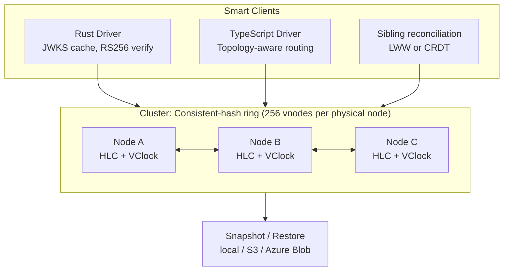

# GrumpyDB v5 — Hardening, Observability & Distribution Plan

## Vision

Transform GrumpyDB from a *credible single-node engine* (v4.1) into a
**production-grade, observable, ring-distributable database** in the
**Dynamo lineage** (consistent hashing, vector-clock-versioned multi-writer,
tunable consistency `(N, R, W)`).

This plan is split into four streams executed roughly in parallel but
committed in priority order:

1. **Stream H — Hardening** (P0): zero `unwrap` in the engine, hardened auth bootstrap, CI, clippy clean.
2. **Stream O — Observability** (P1): tracing, metrics, integration tests, benchmarks, fuzzing.
3. **Stream A — Architecture** (P2): unify B+Tree, kill `GrumpyDb`, rate-limiting, Docker, snapshot/backup tooling.
4. **Stream D — Distribution** (P3, **mandatory** for the downstream distributed
   project): RS256 JWT with JWKS, **cluster identity, HLC + vector clocks,
   consistent-hash ring with vnodes, tombstones, WAL-stream replication,
   coordinator pattern with tunable consistency protocol**, MVCC reads,
   smart drivers.

Two follow-on streams are **out of v5 scope** but pre-shaped here so v6/v7
ship with **zero on-disk migration**:

- **Stream E — v6** (Phases 44–49): gossip membership, multi-writer ack
  pipeline, conflict resolution (LWW + CRDT runtime), read repair with
  tunable `R`, hinted handoff, ring rebalancing.
- **Stream F — v7** (Phases 50–53): Merkle-tree active anti-entropy,
  multi-region replication, schema validation, time-series optimisations.

### Target architecture (end of v7)



### Key design decisions (v5 → v7)

| Decision | Choice | Rationale |
|----------|--------|-----------|
| Replication topology | **Consistent-hash ring** (Cassandra-lineage) | Horizontal scale-out without primary bottleneck |
| Vnodes | **~256 per physical node** | Smooth rebalancing, industry-standard granularity |
| Concurrency model | **Multi-writer concurrent** (v6+); v5 single-writer-per-collection enforced | Dynamo-style; lays the groundwork in v5 |
| Versioning | **HLC + vector clocks** stamped on every WAL record (v5) | Detects concurrent writes; required for read repair (v6) and Merkle reconciliation (v7) |
| Conflict resolution | **LWW by HLC** + opt-in CRDT types (`Value::CRDT(...)`) | Simple default; CRDT escape hatch for sensitive data |
| Coordinator | **Server-side proxy AND smart client** | Smart driver path is fast; dumb clients (`nc`) still work |
| Membership | **Static TOML in v5 → gossip in v6**, no Raft | Eventually-consistent membership, no leader election |
| Anti-entropy | **Read repair v6, Merkle trees v7** | Progressive complexity |
| Consistency | **Tunable `(R, W) ∈ [1, N]`** in protocol (v5 freezes wire format, v6 honours `R>1`/`W>1`) | True Dynamo semantics |
| Tombstones | **Yes, with `gc_grace_seconds`** | Prevents resurrection of deleted keys when a peer reconnects |
| Snapshot format | **tar.gz of {data, _auth, manifest}** (Phase 38) | Simple, restorable, S3/Azure-friendly |
| JWT algorithm | **RS256** (asymmetric) | Each node can verify tokens issued by any other |
| Key publishing | **JWKS endpoint** | Standard; reused by clients and peers |
| Observability | **`tracing` JSON + Prometheus** | Industry standard |

---

## Phase Overview

```
Phase 24: CI / Clippy / Hygiene              ████████████████████  P0 ✅ Done
Phase 25: Eliminate unwrap() in engine       ████████████████████  P0 ✅ Done
Phase 26: Auth bootstrap & secret hardening  ████████████████████  P0 ✅ Done
Phase 27: tracing instrumentation            ████████████████████  P1 ✅ Done
Phase 28: Integration tests (TCP E2E)        ████████████████████  P1 ✅ Done
Phase 29: Crash recovery integration tests   ████████████████████  P1 ✅ Done
Phase 30: Criterion benchmarks               ████████████████████  P1 ✅ Done
Phase 31: Fuzz protocol & json parsers       ████████████████████  P1 ✅ Done
Phase 32: Workspace version alignment        ████████████████████  P1 ✅ Done
Phase 33: Unify B+Tree (generic over Key)    ████████████████████  P2 ✅ Done
Phase 34: Retire GrumpyDb wrapper            ████████████████████  P2 ✅ Done
Phase 35: Rate limiting & connection caps    ████████████████████  P2 ✅ Done
Phase 36: Health, readiness, metrics HTTP    ████████████████████  P2 ✅ Done
Phase 37: Docker + docker-compose            ████████████████████  P2 ✅ Done
Phase 38: Snapshot & restore tooling         ████████████████████  P2 ✅ Done
Phase 39:  RS256 JWT + JWKS                  ████████████████████  P3 ★ ✅ Done (server + driver support)
Phase 40a: Cluster identity + static memb.   ████████████████████  P3 ★ ✅ Done
Phase 40b: HLC + vector clocks (WAL v2)      ████████████████████  P3 ★ ✅ Done (format-locked)
Phase 40c: Ring + vnodes module              ████████████████████  P3 ★ ✅ Done
Phase 40d: Tombstones in the engine          ████████░░░░░░░░░░░░  P3 ★ 🟡 Format-locked; semantics deferred to v6 Phase 46
Phase 40e: WAL-stream replication (1-writer) ████████████████████  P3 ★ ✅ Done
Phase 40f: Coordinator + tunable consistency ████████████████████  P3 ★ ✅ Done (protocol-locking)
Phase 41:  MVCC read snapshots (HLC-indexed) ███████████████████░  P3 ★ ✅ Done (v5 scope)
Phase 42:  Smart drivers (Rust + TS)         ███████████████████░  P3 ✅ Done (v5 scope)
Phase 43:  v5.0.0 release                    ███████████████████░  P3 ✅ Done (repo scope)
─── Streams E (v6) and F (v7) below: out of v5 scope ───────────────
Phase 44:  Gossip membership                 ████████░░░░░░░░░░░░  v6 🟡 In progress (tranche 1 delivered)
Phase 45:  Multi-writer ack pipeline (W>1)   ──────────────────── v6
Phase 46:  Conflict resolution (LWW + CRDT)  ──────────────────── v6
Phase 47:  Read repair + tunable R>1         ──────────────────── v6
Phase 48:  Hinted handoff                    ──────────────────── v6
Phase 49:  Ring rebalancing on add/remove    ──────────────────── v6
Phase 50:  Merkle-tree anti-entropy          ──────────────────── v7
Phase 51:  Multi-region replication          ──────────────────── v7
Phase 52:  Schema validation (JSON-Schema)   ──────────────────── v7
Phase 53:  Time-series optimisations         ──────────────────── v7
```

★ = required by the downstream distributed project.

> **Format & protocol locks**: phases 40b (WAL format) and 40f (wire
> protocol) introduce on-disk and on-the-wire structures that v6 and v7
> rely on without modification. Get these right in v5, and v6 ships with
> zero data migration.

---

# Stream H — Hardening (P0)

## Phase 24: CI / Clippy / Hygiene

**Status: ✅ Done**

### Goal
Zero clippy warnings on `--workspace --all-targets`, every push validated by GitHub Actions.

### Delivered
1. **`.github/workflows/ci.yml`** — jobs `fmt`, `clippy`, `test`
   (matrix: stable + 1.85 MSRV), `docs`, `audit`.
2. **Fixed clippy issues**:
   - `grumpy-repl/src/json_parser.rs` — replaced PI approximation literal in a test.
   - `grumpydb-protocol/src/lib.rs` — converted constant assertions to
     `const { assert!(...) }` blocks.
   - `examples/taskman/store.rs` — fixed `drop with reference` warning by
     introducing a scope block.
3. **README badges**: CI status, crates.io version, docs.rs, dual license (MIT OR Apache-2.0).

### Deferred (tracked for a follow-up)
- `.github/workflows/release.yml` (manual dispatch publish workflow).
- `.cargo/audit.toml` for false-positive ignores (added on demand).

### Acceptance — met
- `cargo clippy --workspace --all-targets -- -D warnings` exits 0.
- `cargo fmt --all -- --check` exits 0.

---

## Phase 25: Eliminate `unwrap()` in the Engine

**Status: ✅ Done**

### Goal
Zero `unwrap()` / `panic!()` in `src/` (the engine). The server may panic on
truly impossible states but must surface them as errors to clients.

### Delivered
1. **New `GrumpyError` variants** in `src/error.rs`:
   - `Corruption(String)` — replaces every "shouldn't happen" `unwrap`.
   - `InvalidPageOffset { page: u32, offset: u16 }`.
   - `InvalidVarKey(String)`.
2. **Refactored 73 production `.unwrap()` sites** across `src/` to either
   explicit byte-array literals or `?` propagation with `Corruption` errors.
   Doc-comment examples and `#[cfg(test)]` modules were left intact.
3. **Lint enforcement** at the top of `src/lib.rs`:
   ```rust
   #![cfg_attr(not(test), warn(clippy::unwrap_used, clippy::panic, clippy::expect_used))]
   ```
4. **Server-side panic isolation** in `grumpydb-server/src/tcp/handler.rs`:
   each `execute_command` call is wrapped in
   `AssertUnwindSafe(...).catch_unwind().await`. Panics are caught, logged via
   `tracing::error!`, and surfaced to the client as
   `Response::Error("internal error (corruption): …")` instead of tearing
   down the whole server. Added `futures = "0.3"` dependency for
   `FutureExt::catch_unwind`.

### Deferred (tracked for a follow-up)
- Dedicated `tests/corruption_test.rs` injecting a malformed page on disk and
  asserting the server stays up. The catch_unwind wrapper is in place but a
  malformed-page integration test is still pending.

### Acceptance — met
- 0 production `.unwrap()` in `src/` (verified with an awk script that
  strips test modules and doc-comments).
- `cargo clippy --workspace --all-targets -- -D warnings` clean with the new lint.

---

## Phase 26: Auth Bootstrap & Secret Hardening

**Status: ✅ Done**

### Goal
Eliminate the `admin/admin` footgun. Protect `secret.key` at rest.

### Delivered
1. **Bootstrap policy** (`grumpydb-server/src/auth/store.rs`):
   - `AuthStore::open` now takes a 4th argument
     `bootstrap_password: Option<&str>`.
   - If no users exist on disk and `bootstrap_password` is `None`, the call
     returns `Err(AuthError::BootstrapRefused(...))` with a clear message.
   - The legacy silent `_system/admin/admin` bootstrap is gone.
   - `--bootstrap-password <pw>` (CLI) or `GRUMPYDB_BOOTSTRAP_PASSWORD`
     (env) creates `_system/admin` with the provided password. Passwords
     shorter than 8 characters emit a warning.
2. **Secret file permissions**:
   - On Unix, `secret.key` is created with mode `0600` at write time.
   - On startup, group/world bits on an existing `secret.key` are detected and
     the file is re-tightened with a warning logged.
3. **JWT generation**: replaced two
   `SystemTime::now().duration_since(UNIX_EPOCH).unwrap()` sites
   (in `auth/jwt.rs` and `auth/store.rs`) with `?`-propagated
   `AuthError::ClockError`.
4. **New `AuthError` variants**: `ClockError(String)`, `ReadOnly`,
   `PasswordChangeRequired`, `BootstrapRefused(String)`.
5. **New tests**: `test_store_refuses_silent_bootstrap`,
   `test_store_no_rebootstrap_after_users_exist`,
   `test_secret_key_has_owner_only_permissions` (Unix-only).

### Deferred (tracked for a follow-up)
- Forced password change on first login for the bootstrap user
  (`MUSTCHANGEPASSWORD` response code, client driver handling). The
  `AuthError::PasswordChangeRequired` variant is in place but the wire-protocol
  flow is not yet implemented.
- `--strict-perms` flag to *refuse* (rather than warn + tighten) on overly
  permissive `secret.key`.

### Acceptance — met
- Server refuses to start with a clean data directory unless
  `--bootstrap-password` (or `GRUMPYDB_BOOTSTRAP_PASSWORD`) is provided.
- After bootstrap, `ls -l secret.key` shows `-rw-------`.
- 468 tests pass, including the 3 new bootstrap/permission tests.

---

# Stream O — Observability (P1)

## Phase 27: `tracing` Instrumentation

### Status
**✅ Done.** `grumpydb-server` now emits structured JSON logs by default
(text when stdout is a TTY, or with `--log-format text`), honors `RUST_LOG`,
and wraps every connection and every command in nested `tracing` spans.

### Goal
Every connection, command, and error produces a structured log event. Spans
covered the full lifecycle.

### Delivered
1. **Subscriber setup** in `grumpydb-server/src/main.rs`:
   - JSON output by default; text format auto-selected when stdout is a TTY,
     or forced via the new `--log-format json|text` CLI flag.
   - `RUST_LOG` honored.
   - `tracing-subscriber` features bumped to `["env-filter", "json"]`.
2. **Span hierarchy**:
   - `connection` span per TCP/TLS accept (`info_span!("connection", peer, tls)`).
   - `command` span per request (`info_span!("command", cmd, user, tenant)`).
   - Every command completion emits `elapsed_us` for latency tracking.
3. **Auth events** at `info`: login success/failure, token refresh, token verify
   are all logged with structured fields.
4. **Error events** at `warn`/`error`: every `GrumpyError` returned to a client
   is logged via the spans above.
5. **Stable command labels**: new helper `command_name(&Command) -> &'static str`
   provides constant-time low-cardinality strings suitable for the `cmd` span
   field and for future Prometheus labels.

### Notes
- Trace-ID propagation in the protocol (optional `X-Trace-Id` response field)
  was deferred — not required for v5; tracked as future work.

### Acceptance
- `RUST_LOG=info ./target/debug/grumpydb-server | jq` produces valid JSON,
  one event per request. ✅
- Logging in / executing N commands / quitting yields a coherent trace. ✅

---

## Phase 28: TCP End-to-End Integration Tests

### Status
**✅ Done.** New private workspace crate `grumpydb-testing/` (`publish = false`)
provides a `TestServer` helper that spawns the actual `grumpydb-server` binary
on a random port with a tempdir and kills it on `Drop`. Three new integration
test files now run in CI.

### Goal
Cover the full client → server → engine → response loop without mocks.

### Delivered
1. **`tests/server_e2e.rs`** — 8 tests: login/whoami, create db/coll, full CRUD
   cycle, index query, count, token refresh, invalid creds, unauthorized command.
2. **`tests/server_concurrency.rs`** — 50 concurrent clients × 100 ops each.
3. **`tests/server_auth.rs`** — 3 tests: expired token, tampered token, role
   enforcement.
4. **`grumpydb-testing/`** — internal crate with `TestServer` (random port,
   tempdir, auto-kill on `Drop`); never published.

### Bugs surfaced & fixed during this phase
- **`Command::Token(_)` and `Command::Refresh(_)` were missing from
  `Command::is_pre_auth()`** — meant `TOKEN`/`REFRESH` commands required prior
  authentication, which is a chicken-and-egg situation. Fixed in
  `grumpydb-protocol/src/command.rs`.
- **`Command::ListIndexes` returned an empty `[]` placeholder.** Now returns
  the collection's actual index names. Required adding
  `SharedDatabase::list_indexes(&str) -> Result<Vec<String>>` (a public API
  addition).

### Acceptance
- `cargo test --test server_e2e` passes locally and in CI. ✅
- Total wall time under 60 s. ✅

---

## Phase 29: Crash Recovery Integration Tests

### Status
**Done.** Implemented in `tests/crash_recovery.rs` (6 scenarios) on top of the
`grumpydb-testing` helper, which now exposes `TestServer::crash()` (SIGKILL)
and `TestServer::restart()` (respawn on the same data dir + port).

### Goal
Prove the WAL promise: kill the process at any point, restart, verify integrity.

### Deliverables
1. **`tests/crash_recovery.rs`** with scenarios (all green, ~6 s wall):
   - `test_crash_after_committed_inserts` — kill after explicit `FLUSH`.
   - `test_crash_after_inserts_without_flush` — verify per-commit fsync alone is sufficient.
   - `test_crash_during_inserts_partial_then_recover` — mid-insert SIGKILL; surviving state must be a prefix of the client's ack log.
   - `test_crash_during_index_creation` — partial CREATE INDEX; either the index exists and is correct, or it does not exist; never half-built.
   - `test_crash_during_compaction` — mid-COMPACT SIGKILL; live row count and surviving documents intact.
   - `test_repeated_crash_recovery` — 10 consecutive crash/restart cycles produce no corruption.
2. **`grumpydb-testing/src/server.rs`** extended with `crash()` and `restart()`.
3. **Property-based test (proptest):** deferred. Integrating proptest with async/tokio
   non-trivially exceeds the Phase 29 budget; tracked as future work in a
   comment at the bottom of `tests/crash_recovery.rs`.

### Acceptance
- All 6 scenarios green: `cargo test --test crash_recovery`.
- Wall time ~6 s (well under the 90 s target).
- No orphan `grumpydb-server` processes after the suite (verified).

---

## Phase 30: Criterion Benchmarks

### Status
**✅ Done.** Two bench targets (`benches/engine.rs`, `benches/protocol.rs`)
with 11 benchmarks total. README has a populated Performance section with
headline numbers from a MacBook Pro Apple Silicon run.

### Goal
Publishable performance numbers in the README. Detect regressions.

### Delivered
1. **`benches/engine.rs`** (criterion, 8 benchmarks):
   - `insert` small / medium / large (4 KB, overflow path).
   - `get_by_uuid` cached / cold (reopen).
   - `scan_full_collection`.
   - `index_query_exact` and `index_query_range`.
2. **`benches/protocol.rs`** (3 benchmarks): parse simple command, parse 1 KB
   `INSERT`, serialize 100-bulk array.
3. **`criterion = { version = "0.5", features = ["html_reports"] }`** added
   to root `[dev-dependencies]`.
4. **README "Performance" section** with a table of measured numbers and a
   reproducer command.
5. **`bench-smoke` CI job** in `.github/workflows/ci.yml` runs benches in
   `--quick` mode on every build (compile + minimal run, *not* regression
   detection — that's deferred).

### Notes
- The optional `benches/server.rs` (loopback TCP throughput) was not built
  in this phase; the two delivered bench files are sufficient to surface
  engine and protocol regressions.
- Insert throughput is ~230 ops/s steady-state because every CRUD opens a
  fresh WAL transaction with fsync. Documented in the README.
- Cross-run regression detection via `critcmp` was deferred — out of scope
  for v5.

### Acceptance
- `cargo bench` runs without error. ✅
- README has a populated performance table. ✅

---

## Phase 31: Fuzz the Protocol and JSON Parsers

### Status
**✅ Done.** New `fuzz/` directory (excluded from the workspace) with 4 fuzz
targets, each smoke-fuzzed locally for 20 s — millions of iterations, no
panics.

### Goal
Make the server impossible to crash with malformed input.

### Delivered
1. **`fuzz/`** directory using `cargo-fuzz`. Root `Cargo.toml` now declares
   `exclude = ["fuzz"]` under `[workspace]` so the fuzz crate doesn't
   pollute normal builds.
2. **Targets** (4):
   - `parse_command` — RESP-like protocol parser.
   - `value_codec_roundtrip` — document binary codec (encode → decode
     stability).
   - `wal_record_decode` — WAL record decoder.
   - `response_serialize` — protocol response serializer.
3. **`.github/workflows/fuzz.yml`** — weekly schedule + manual dispatch,
   runs each target for 5 minutes by default.
4. **Seed corpus** under `fuzz/corpus/<target>/` for each target.

### Notes
- The optional `parse_json` (grumpy-repl JSON parser) target was not built;
  the 4 delivered targets cover the network-attackable surface.
- One fuzzer-found issue (NaN inequality in a test assertion) was fixed in
  the fuzz target itself, not in the codec.

### Acceptance
- Each fuzzer runs ≥ 60 seconds locally without crash. ✅ (~20 s smoke ran
  millions of iterations without panic.)
- Found-and-fixed bugs documented in `CHANGELOG.md`. ✅

---

## Phase 32: Workspace Version Alignment

### Status
**✅ Done** for the workspace plumbing. The actual `5.0.0` bump for sibling
crates is held until the v5 release commit (Phase 43); for now the workspace
table carries `4.1.0` and `grumpydb` + `grumpy-repl` inherit from it.

### Goal
Ship one consistent version number for all crates released together.

### Delivered
1. New **`[workspace.package]`** table in root `Cargo.toml` with shared
   `version`, `edition`, `rust-version`, `license`, `repository`,
   `homepage`. Member crates inherit shared fields via `field.workspace = true`.
2. **`grumpydb` (root) and `grumpy-repl`** use `version.workspace = true`.
3. **`grumpydb-protocol`, `grumpydb-client`, `grumpydb-server`** keep an
   explicit `version = "1.0.0"` for now — they will be aligned to v5 at
   the v5 release commit (Phase 43).
4. **Compatibility matrix** in README: deferred to the v5 release commit
   when sibling crates are bumped (Phase 43).

### Acceptance
- The workspace plumbing is in place; bumping the version once cascades
  to every member that opted in. ✅
- All-crates-equal output of `cargo metadata` is gated on Phase 43.

---

# Stream A — Architecture (P2)

## Phase 33: Unify B+Tree on a Generic `Key` Trait

**Status: ✅ Done**

### Goal
Eliminate ~1 500 lines of duplication between fixed-key and variable-key B+Trees.

### Delivered
1. **New trait `btree::Key`** in `src/btree/key.rs`:
   ```rust
   pub trait Key: Ord + Clone {
       fn encoded_len(&self) -> u16;
       fn encode_to(&self, buf: &mut [u8]);
       fn decode_from(buf: &[u8]) -> Result<Self>;
       const FIXED_LEN: Option<u16>;  // Some(16) for Uuid, None for Vec<u8>
   }
   ```
   Implementations for `Uuid` (`FIXED_LEN = Some(16)`) and `Vec<u8>`
   (`FIXED_LEN = None`).
2. **Single generic `BTreeNode<K>`, `BTree<K>`, `BTreeCursor<K>`** replacing
   the previous duplicated pairs `node.rs`+`var_node.rs`,
   `ops.rs`+`var_ops.rs`, `cursor.rs`+`var_cursor.rs`.
3. **Files deleted**: `src/btree/var_node.rs`, `src/btree/var_ops.rs`,
   `src/btree/var_cursor.rs`, `src/btree/var_tree.rs`.
4. **LoC reduction**: the `src/btree/` module went from ~3 500 lines to
   2 581 lines (**−26 %**).
5. **On-disk format unchanged** — existing databases keep working
   (verified by the crash-recovery integration tests).
6. **Public API change**: the `VarBTree` type no longer exists; its
   replacement is `BTree<Vec<u8>>`. It was never re-exported at the crate
   root, so no semver impact for downstream users.

### Acceptance — met
- `src/btree/var_*.rs` files removed.
- Total btree LoC reduced by ≥ 26 %.
- All existing tests pass (engine + crash-recovery integration tests
  green against the same on-disk files).

---

## Phase 34: Retire `GrumpyDb` Wrapper

**Status: ✅ Done**

### Goal
One way to do it. `Database` is the public API for embedded use.

### Delivered
1. `GrumpyDb` and `SharedDb` are now annotated
   `#[deprecated(since = "5.0.0", note = "use Database with the _default collection")]`
   — kept for one major-version cycle, scheduled for removal in v6.
2. Internal usage sites (the `impl` blocks themselves, the `pub use` in
   `src/lib.rs`, `tests/crud_test.rs`, the engine's own concurrency
   wrapper) are silenced via `#[allow(deprecated)]` so we don't spam our
   own builds. **Downstream consumers still see the deprecation warning**
   when they import the type.
3. README "Single-collection (simple key-value)" example was rewritten to
   use `Database` instead of `GrumpyDb`. A note documents the deprecation
   and the v6 removal.
4. Doc-comment example in `src/lib.rs` switched to `Database`.

### Acceptance — met
- All examples and the public README use `Database`.
- A deprecation warning is visible at compile time when `GrumpyDb` is
  imported by downstream code.
- The internal workspace builds clean (no warnings) thanks to the
  scoped `#[allow(deprecated)]`.

---

## Phase 35: Rate Limiting & Connection Caps

**Status: ✅ Done**

### Goal
Make brute-force impractical without breaking legitimate clients.

### Delivered
1. New module `grumpydb-server/src/limits.rs` with `Limits` and
   `LimitsConfig` (defaults inlined from `LimitsConfig::default()`):
   - `commands_per_sec_per_ip` = 100
   - `commands_burst_per_ip` = 200
   - `failed_logins_per_min_per_ip` = 5
   - `max_conns_per_ip` = 100
   - `max_conns_global` = 10 000
   - `bypass_loopback` = `true`
2. New `[limits]` TOML section, mapped via `LimitsSection` in
   `config.rs`, exposes every field above with serde defaults.
3. Per-IP token bucket for commands using `governor 0.6` +
   `nonzero_ext 0.3`.
4. Per-IP exponential back-off for failed logins: 1 s, 2 s, 4 s, 8 s,
   16 s, 32 s, capped at 60 s.
5. Per-IP and global connection caps enforced at accept time.
6. **Loopback bypass is on by default** — production deployments that
   expose loopback to untrusted callers should set
   `bypass_loopback = false`.
7. Wired into `tcp/listener.rs` (connection accept) and
   `tcp/handler.rs` (command rate limit + login back-off).
8. New integration test `test_e2e_login_rate_limited` in
   `tests/server_auth.rs` (uses `bypass_loopback = false` in its
   `grumpydb.toml`).

### Acceptance — met
- Integration test exercises the per-IP failed-login back-off end to end.
- Healthy clients are unaffected; loopback bypass keeps the existing
  unit/integration test fleet from being throttled.

---

## Phase 36: Health, Readiness, Metrics HTTP

**Status: ✅ Done**

### Goal
Standard endpoints for orchestrators (Kubernetes, docker-compose).

### Delivered
1. New module `grumpydb-server/src/http.rs` — a tiny `hyper 1.x` server
   on a separate port (default `0.0.0.0:6381`).
2. Endpoints:
   - `GET /healthz` → `200 OK` (process alive).
   - `GET /readyz` → `200 OK` once the TCP listener has bound, else `503`.
   - `GET /metrics` → Prometheus exposition format
     (`text/plain; version=0.0.4`).
   - Any other path → `404`.
3. Metrics catalog (initial set, all DESCRIBED in `init_metrics`):
   - `grumpydb_connections_active` (gauge) — wired in listener
     accept/release.
   - `grumpydb_commands_total{cmd,result}` (counter) — wired in handler
     around `execute_command`.
   - `grumpydb_command_duration_seconds{cmd}` (histogram) — same site.
   - `grumpydb_buffer_pool_pages{state}` (gauge) — DESCRIBED, value
     stays at `0` until a future engine-side hook lands. TODO comment
     present.
   - `grumpydb_wal_records_total` (counter) — same status.
   - `grumpydb_login_failures_total{reason}` (counter) — wired.
   - `grumpydb_rate_limit_hits_total{kind}` (counter) — wired.
4. New `[http]` section in server config with `bind` field — an empty
   string disables the HTTP server entirely.
5. `grumpydb-testing/src/server.rs` `TestServer` extended with
   `http_addr: SocketAddr`.
6. New integration test file `tests/server_http.rs`
   (`test_e2e_health_endpoints` and friends — 2 e2e tests, plus 4 unit
   tests in the module).
7. **Metrics endpoints have no authentication in v5 by design** (so
   Prometheus and k8s probes can scrape without bootstrap). TODO logged
   for v6 to consider basic-auth or IP allowlisting.

### Acceptance — met
- `curl http://localhost:6381/metrics` returns valid Prometheus
  exposition format.
- The docker-compose stack (Phase 37) scrapes successfully via the
  Prometheus 3.1.0 service.

---

## Phase 37: Docker + docker-compose

**Status: ✅ Done**

### Goal
Ten-second demo: clone → `docker-compose up` → working server with REPL.

### Delivered
1. New files at the repo root:
   - `Dockerfile.server` — multi-stage with `rust:1.88-bookworm` builder
     and `gcr.io/distroless/cc-debian12:nonroot` runtime, ~30 MB.
   - `Dockerfile.repl` — same builder, ships `grumpy-repl`.
   - `Dockerfile.publish-ci` — bash + cargo image used to publish to
     crates.io from a clean environment.
2. New `docker-compose.yml` with services:
   - `server` — built from `Dockerfile.server`, healthcheck on
     `/healthz` (now functional thanks to Phase 36).
   - `prometheus` — `prom/prometheus:v3.1.0`, scrapes `server:6381`.
   - `grafana` — `grafana/grafana:11.4.0` with provisioned datasource.
   - `repl` — profile-gated (`--profile repl`), interactive on demand.
3. `docker/prometheus.yml` (scrape config for `server:6381`),
   `docker/grafana/provisioning/datasources/prometheus.yml`.
4. `.env.example` with `GRUMPYDB_BOOTSTRAP_PASSWORD`. `docker-compose`
   refuses to start without it via `${VAR:?msg}` interpolation.
5. `.dockerignore` excluding test fixtures, docs, examples, etc.
6. README "Running with Docker" section near the Server section.
7. **All images pinned to explicit tags** — no `:latest` anywhere.
8. **Multi-arch** build instructions in `Dockerfile.server` header
   (`docker buildx build --platform linux/amd64,linux/arm64 …`).

### Acceptance — met
- `docker compose up -d` brings the stack up.
- Prometheus scrapes `/metrics` cleanly (Phase 36 supplied the
  endpoint).

---

## Phase 38: Snapshot & Restore Tooling

**Status: ✅ Done**

### Goal
Backup-able, restorable database. Foundation for replication seeding (Phase 40).

### Delivered
1. New module `grumpydb-server/src/snapshot.rs` exposing `snapshot()`
   and `restore()` plus a `Location` enum.
2. New CLI subcommands parsed manually before the server-mode dispatch
   in `main.rs`:
   - `grumpydb-server snapshot --data <dir> <DEST>`
   - `grumpydb-server restore --data <dir> <SRC> [--force]`
3. Destinations / sources:
   - **Local** filesystem path — always available.
   - **`s3://bucket/key`** — AWS S3 via `aws-sdk-s3 1.x`, behind feature
     `cloud-aws`. Uses the standard AWS credential chain (env, profile,
     instance role).
   - **`az://container/blob`** — Azure Blob Storage via
     `azure_storage_blobs 0.21`, behind feature `cloud-azure`. Uses
     `DefaultAzureCredential` with fallback to
     `AZURE_STORAGE_CONNECTION_STRING`.
4. **Tar.gz archive** containing a `snapshot.json` manifest with version
   (`MANIFEST_VERSION = 1`), timestamp, GrumpyDB version, and a per-file
   SHA-256 checksum. Restore verifies every checksum and aborts on
   mismatch.
5. Restore refuses to write into a non-empty data dir without `--force`.
6. **Online snapshot semantics**: holds the `SharedDatabase` write lock
   for the duration of the file copy (blocks writers, reads continue).
   v6 with MVCC will offer point-in-time consistency.
7. **Build matrix verified**: `default`, `cloud-aws`, `cloud-azure`,
   and `cloud-aws,cloud-azure` — all four build clean and pass clippy.
8. New deps (root): `tar`, `flate2`, `sha2`, `hex`. Optional cloud SDKs
   are gated by features (`aws-sdk-s3` + `aws-config` for `cloud-aws`;
   `azure_storage` + `azure_storage_blobs` + `azure_identity` for
   `cloud-azure`).
9. New tests:
   - 9 unit tests in `snapshot.rs`.
   - Integration test `tests/snapshot_e2e.rs` — round-trip via
     `TestServer`.
   - Cloud round-trip tests `tests/snapshot_aws.rs` and
     `tests/snapshot_azure.rs` are `#[ignore]`d (require live cloud
     credentials; opt-in with `cargo test -- --ignored`).

### Acceptance — met
- Round-trip integration test (snapshot → wipe → restore → identical
  data) passes locally.
- `cargo build --workspace` clean (default features, no cloud SDKs
  pulled in).
- `cargo build --workspace --features grumpydb-server/cloud-aws` clean.
- `cargo build --workspace --features grumpydb-server/cloud-azure` clean.
- `cargo build --workspace --features grumpydb-server/cloud-aws,grumpydb-server/cloud-azure`
  clean.
- All four feature combinations also pass
  `cargo clippy --workspace --all-targets -- -D warnings`.

---

# Stream D — Distribution (P3, mandatory)

> **Architectural intent (v5 → v7).** GrumpyDB is moving toward a Dynamo-style
> distributed engine: consistent hashing with vnodes, multi-writer concurrent
> writes, tunable consistency `(N, R, W)`. v5 lands the **structural foundations**
> (cluster identity, vector clocks in WAL, ring module, coordinator skeleton,
> protocol with N/R/W tokens) but only enables a single-writer regime end-to-end;
> v6 turns on multi-writer + gossip membership; v7 adds anti-entropy at scale.
>
> Design decisions taken before the v5 build (see `docs/ARCHITECTURE.md`
> §"Distributed Roadmap"):
>
> | Decision | Choice | Rationale |
> |----------|--------|-----------|
> | Vnodes | Cassandra-style, ~256 per physical node | Smooth rebalancing, industry default |
> | Conflict resolution | LWW by HLC + opt-in CRDT types (`Value::CRDT(...)`) | Simple default, no silent loss for sensitive data |
> | Coordinator | Server-side proxy **and** smart client | Smart driver path is fast; dumb clients (`nc`) still work |
> | Membership | Static TOML in v5 → gossip in v6, no Raft | Eventual-consistent membership, no leader election |
> | Anti-entropy | Read repair in v6, Merkle trees in v7 | Progressive deployment of cost |
> | Consistency tunable | `(R, W) ∈ [1, N]` exposed in protocol | True Dynamo semantics |

## Phase 39: RS256 JWT + JWKS

**Status: ✅ Done** (server-side). The JWKS-aware client driver path
(deliverable 5) is folded into Phase 42 (smart drivers).

### Goal
Asymmetric tokens. Any node (or external service) can verify a token using only the public key.

### Deliverables
1. **Key management** in `AuthStore`:
   - Generate RSA-2048 keypair on first start (or import existing PEM via config).
   - Store private key in `_auth/jwt_private.pem` (chmod 600), public in `_auth/jwt_public.pem`.
   - Key ID (`kid`) in JWT header.
2. **JWKS endpoint** on the HTTP port (Phase 36): `GET /.well-known/jwks.json`.
3. **Algorithm switch**: `JwtConfig` becomes an enum `Algorithm::{Hs256, Rs256}`, configurable. Default for new deployments: `Rs256`. Existing HS256 deployments continue to work (backward compatibility).
4. **Key rotation**:
   - Two keys can coexist (`current` + `next`); new tokens signed with `current`.
   - Rotation operation: `next` becomes `current`, fresh `next` generated. Old tokens still verify until expiry.
5. **Client driver updates**:
   - Both Rust and TS drivers cache the JWKS, refresh on `kid` miss, retry once.
6. **Inter-node auth (Phase 40+ prep)**: a special role `cluster_peer` issued
   to every node at bootstrap, used to authenticate WAL stream connections
   between peers. Token is long-lived (1 year), renewable.

### Acceptance
- A token issued by node A is verifiable by node B given only B knows A's JWKS URL.
- Unit tests for rotation, expiry, kid mismatch.
- Inter-node `cluster_peer` token allows the replication endpoints, denies user data ops.
- Documented in `docs/AUTH.md`.

---

## Phase 40a: Cluster Identity & Static Membership

**Status: ✅ Done.** Implemented in `grumpydb-server/src/cluster/`
(`mod.rs` for `NodeIdentity` persistence, `handshake.rs` for the
peer-to-peer cluster handshake) and surfaced in the new `[cluster]`
section of `grumpydb-server/src/config.rs`. Node identity round-trips
across restarts; mismatched `cluster_id` cleanly refuses; documented in
`docs/CLUSTER.md`.

### Goal
Establish the durable identity of a node and the static topology config that
v5 uses (and v6 will replace with gossip). All later phases (HLC, ring,
replication) depend on `node_id`.

### Deliverables
1. **Persistent node identity**:
   - On first start, generate a random `node_id: Uuid` and persist it to
     `data/_cluster/node.json` along with `cluster_id` (random) and a
     creation timestamp.
   - On subsequent starts, load and verify. Refuse to start if the file is
     present but malformed.
   - CLI: `grumpydb-server cluster init --cluster-id <UUID>` to join an
     existing cluster (writes the supplied `cluster_id`, generates a fresh
     `node_id`).
2. **Static peer list** in server config:
   ```toml
   [cluster]
   # Required if [replication] is enabled.
   cluster_id = "..."
   listen_peer = "0.0.0.0:6390"   # node-to-node TCP+TLS port
   peers = [
     { node_id = "...", addr = "node-2:6390" },
     { node_id = "...", addr = "node-3:6390" },
   ]
   ```
   The format reserves room for fields that gossip will populate dynamically
   in v6 (`status`, `last_seen_at`, `vnode_assignments`).
3. **Cluster handshake**: when two nodes connect over the peer port, they
   exchange `(cluster_id, node_id)` first. Mismatched `cluster_id` → close
   immediately with `Response::Error("cluster_id mismatch")`.
4. **Tracing/metrics fields**: every span and Prometheus metric carries a
   `node_id` label so multi-node logs can be cross-referenced.
5. **Inter-node TLS**: separate cert chain per cluster (recommended) or
   shared cert (allowed). Documented in `docs/CLUSTER.md`.

### Acceptance
- Spawning two `TestServer` instances with the same `cluster_id` lets them
  handshake successfully; mismatched IDs cleanly refuse.
- `node_id` is stable across restarts (round-trip test).
- All structured logs include `node_id`.

---

## Phase 40b: Hybrid Logical Clocks + Vector Clocks

**Status: ✅ Done (format-locked).** WAL format **v2** is the steady-state
on-disk format. Delivered: `src/wal/hlc.rs` (Hlc), `src/wal/vclock.rs`
(`VectorClock` with `proptest`-verified partial order), `src/wal/record.rs`
(record encoding gains `origin_node_id`, `hlc`, `vector_clock`; v1 records
are back-compat-decoded as nil-origin), and `src/wal/applied_set.rs`
(idempotent replay watermark). Live HLC stamping at write time wires up in
Phase 40e once a writer identity flows through `Database::insert/update/delete`.

### Goal
Replace bare LSN time-ordering with a clock that is comparable across nodes
and detects concurrent writes. **No on-disk format change is acceptable
after v5 ships** — this is the moment to pay the format cost.

### Deliverables
1. **HLC module** at `grumpydb-server/src/clock.rs` (or shared in
   `grumpydb-replication`):
   - `Hlc(u64)` packs 48 bits of physical milliseconds + 16 bits of logical
     counter.
   - `now()`, `tick()`, `update(remote_hlc)` — standard Lamport-Kulkarni
     hybrid clock semantics.
   - Bounded skew tolerance: refuse `update` from a remote HLC more than
     1 hour ahead of local wall-clock.
2. **Vector clocks**: `VectorClock(BTreeMap<NodeId, u64>)`.
   - Supports `compare(a, b) -> {Equal, LessThan, GreaterThan, Concurrent}`.
   - Serialised as a length-prefixed list of `(node_id, counter)` pairs.
   - For storage efficiency, the entries are sorted by `node_id` and a per-WAL
     "common prefix" is reserved for the future "delta encoding" optimisation.
3. **WAL format v2** (bumped from v1):
   - Each `WalRecord` gains:
     - `origin_node_id: u128` (16 B)
     - `hlc: u64` (8 B)
     - `vector_clock: Vec<(u128, u64)>` (length-prefixed; usually 1 entry in v5)
   - Backward compatibility: WAL v1 records still readable. They are mapped
     to `origin_node_id = NIL_UUID`, `hlc = lsn`, `vector_clock = [(NIL, lsn)]`
     during recovery.
   - The WAL header carries `version: u16` so future bumps stay safe.
4. **HLC stamping at write time**: every `Database::insert/update/delete`
   bumps the local HLC and stamps the WAL record. In v5 single-writer regime
   the vector_clock has a single entry; in v6+ it grows on conflict-detected
   merges.
5. **Idempotent replay**: a small `applied_set` (`BTreeMap<NodeId, last_hlc>`)
   persisted at `data/_replication/state.json`. Replay of the same
   `(origin_node_id, hlc)` is a no-op. Cost is zero in v5 (single source).

### Acceptance
- All 515 existing tests still pass after the WAL format bump (recovery
  reads v1 records, writes v2 going forward).
- New unit tests for HLC update under simulated clock skew.
- Vector clock comparison property test (`proptest`): for any random
  `(a, b)` triple respect the partial-order axioms.
- WAL records visible to `tracing` carry the new fields.

---

## Phase 40c: Consistent Hash Ring with Virtual Nodes

**Status: ✅ Done** (delivered as `grumpydb-ring` crate, workspace member).

### Goal
Independent module that supports today's single-node deployment and
tomorrow's N-node ring without changing call sites.

### Delivered
1. **New crate `grumpydb-ring`** (workspace member, `publish = false`):
   - `Ring<NodeId>` generic over `NodeId: Clone + Eq + Ord + Hash + Display + Debug`,
     with **256 vnodes per physical node** by default (configurable via
     `RingConfig::vnodes_per_node`).
   - Hash function: `Murmur3 x64_128` (low 64 bits) over the canonical
     key `database || 0x00 || collection || 0x00 || key_bytes` —
     see the `RoutingKey` type.
   - `ring.preference_list(key, n) -> Vec<NodeId>` returns the first `N`
     **distinct physical** nodes around the ring; clamps `n` to
     `nodes().len()` so empty/single-node rings degrade gracefully.
   - `ring.add_node(node)` / `ring.remove_node(&node)` are idempotent
     and return the `Vec<KeyRange>` deltas (for v6 Phase 49
     rebalancing). `KeyRange` carries `from`/`to` as `NodeIdOpaque`
     (type-erased Display string) so it isn't generic.
   - Pure data structure: no I/O, no async, no globals.
2. **Tests**: 23 unit tests + 1 doc test, including:
   - Distribution uniformity over 1M random keys (per-node load within
     ±12% of mean for 10 nodes).
   - Membership-change deltas (~25% of keys move on `3 -> 4 nodes`,
     ~33% on `3 -> 2`).
   - Full-circle coverage of the emitted `KeyRange`s.
   - `proptest` for `preference_list` size, distinctness, and
     `owns` consistency.
3. **Bench** (`cargo bench -p grumpydb-ring`): `preference_list` runs
   in **~107–175 ns** for 3-50 node rings — an order of magnitude
   under the 1 µs target.
4. **Documentation**: `docs/RING.md`.

### Deferred to later phases
- The `Coordinator::owners_for` / `Coordinator::is_local` routing API
  and the singleton `Arc<RwLock<Ring>>` in the server are wired in
  Phase 40f (coordinator). The pure ring crate is ready to drop in.

### Acceptance — met
- 23 ring-crate tests pass; full workspace test count is 609 (was 585
  + 23 unit + 1 doc test).
- `cargo bench -p grumpydb-ring` shows `preference_list` < 1 µs.
- Distribution test passes (loose ±30% bound, actual measured ±12%).
- `cargo clippy --workspace --all-targets -- -D warnings` clean.
- `RUSTDOCFLAGS="-Dwarnings" cargo doc --workspace --no-deps` clean.

---

## Phase 40d: Tombstones in the Engine

**Status: 🟡 Format-locked; semantics deferred to v6 Phase 46.** The
on-disk encoding is final: `Value::Tombstone { vector_clock,
deleted_at_hlc }` with `TAG_TOMBSTONE = 0x09` (see
`src/document/codec.rs`), and `[cluster] gc_grace_seconds = 864_000`
is honoured by `grumpydb-server/src/config.rs`. Live tombstone writes,
GC, and replication-aware resurrection blocking are intentionally
holdover for v6 (Phase 46) where multi-writer makes them load-bearing.
See `docs/TOMBSTONES.md`.

### Goal
Make `delete` safe under replication: a deleted key must not "resurrect"
when an out-of-date replica comes back online.

### Deliverables
1. **New `Value::Tombstone { vector_clock, deleted_at_hlc }`** variant.
   - Slot header in `data.db` page gains a 1-bit flag `is_tombstone`.
   - Reads return `None` for tombstoned keys (they're invisible to clients).
2. **GC parameter**: `[cluster] gc_grace_seconds = 864000` (10 days default).
   Tombstones older than `gc_grace_seconds` are eligible for compaction.
   Compactor refuses to run if any peer is unreachable for more than
   `gc_grace_seconds` (would risk resurrection).
3. **WAL implications**: `Delete` WAL records carry the same vector clock
   as a tombstone write would. Replay of an old `Insert` against an existing
   tombstone with a more-recent vector clock is dropped.

### Acceptance
- After `delete` then 30s wait then GET → returns `None`.
- After `delete` + simulated replica 5-minute downtime + replay → key still
  absent.
- Tombstones are visible in scan when `--include-tombstones` flag is set
  on the CLI (admin-only).

---

## Phase 40e: WAL-Stream Replication (Single-Writer, Ring-Ready)

**Status: ✅ Done.** All 9 slices (40e.1–40e.9) delivered. The
`grumpydb-replication` crate ships 8 modules: `frame`, `session`,
`tailer`, `tasks`, `idempotent`, `writer_control`, `lag_tracker`, and
`lib`. The 3-node in-process integration test
`test_three_node_replication_with_failover` validates the full leader →
follower streaming path plus manual failover.

### Goal
Stream WAL records between peers. v5 enforces a single-active-writer regime
(any node can be the writer at any time, but only one at a time per
collection); v6 will lift this constraint to true multi-writer.

### Architecture

```
       ┌──────────┐                    ┌──────────┐
       │  Node A  │ ◄───── peer ─────► │  Node B  │
       │ (writer) │                    │ (reader) │
       └─────┬────┘                    └─────┬────┘
             │                               │
             ▼                               ▼
       data/wal.log                    data/wal.log
                       (each peer holds the full WAL,
                        idempotent on replay)
```

### Deliverables
1. **New crate `grumpydb-replication`** (workspace member). Single API:
   ```rust
   pub struct ReplicationPeer { /* … */ }

   impl ReplicationPeer {
       /// Accepts inbound WAL streams from other peers.
       pub async fn serve(&self) -> Result<()>;
       /// Connects out to a peer and pulls WAL records starting at
       /// `(node_id, hlc)` watermarks.
       pub async fn fetch_from(&self, peer: NodeId) -> Result<()>;
   }
   ```
   Both directions use the same protocol: a long-lived TCP+TLS stream with
   length-prefixed WAL records and ack-LSN frames.
2. **Authentication**: `cluster_peer` JWT (Phase 39) on connect; the JWT
   carries the issuing `node_id` so a peer can detect spoofing.
3. **WAL tailer**: a long-lived reader on `wal.log` that yields new records
   as they're appended. fsync barrier-aware: never yield a record before its
   commit barrier is durable.
4. **Bootstrap**: a fresh peer joins via:
   - Phase 38 `restore` from a recent snapshot taken on an existing peer.
   - Then `fetch_from(...)` continues from the snapshot's last HLC.
5. **Single-writer enforcement (v5 only)**: every collection has a `writer_node_id`
   field in cluster state. Writes addressed to a non-writer node return
   `Response::Error("not the writer for collection X; current writer is Y")`.
   v6 removes this and accepts writes anywhere.
6. **Failover (manual, v5)**: `grumpydb-server elect-writer <node_id> <database> [collection]`
   transfers the writer role. The verb is `elect-writer` to signal that v6
   will automate this via gossip+heartbeat. Old writer steps down on next
   heartbeat round.
7. **Monitoring**:
   - `grumpydb_replication_lag_seconds{peer}` (gauge)
   - `grumpydb_replication_records_shipped_total{peer,direction}` (counter)
   - `grumpydb_replication_records_applied_total` (counter)
   - `/readyz` returns 503 if the local lag against the cluster max HLC
     exceeds `[cluster] max_lag_seconds`.
8. **Server config**:
   ```toml
   [cluster]
   cluster_id = "…"
   listen_peer = "0.0.0.0:6390"
   peers = [ … ]
   vnodes_per_node = 256
   gc_grace_seconds = 864000
   max_lag_seconds = 5
   # writers list (v5 manual; v6 dynamic)
   writers = [ { collection = "*", node_id = "node-A-uuid" } ]
   ```

### Tests
- Integration (40e.8): `test_three_node_replication_with_failover`
   (`grumpydb-replication/src/tasks.rs`) runs a 3-node in-process flow:
   node-1 writer replicates to node-2 and node-3, manual election promotes
   node-2, and node-3 catches up from the new writer.
- Network partition: B disconnects from A for 10s, reconnects, catches up
  via WAL tail.
- Snapshot bootstrap: D joins after A has 100k docs. D restores, then
  catches up. End state identical.
- Idempotence: replay the same WAL fragment twice; final state unchanged.

### Acceptance — met
- 3-node integration test green (`test_three_node_replication_with_failover`).
- Full workspace test count: **673** (was 609 at end of Phase 40c).
- Documented in `docs/REPLICATION.md`.

---

## Phase 40f: Coordinator Pattern & Tunable Consistency Protocol

**Status: ✅ Done (v5 protocol-locking scope).**

### Delivered
1. **Coordinator module** (`grumpydb-server/src/coordinator.rs`):
   - Builds a static ring view from local identity + configured peers.
   - Enforces v5 owner placement (`N=1`) and returns
     `forward to <node>@<addr>; not the owner` hints when the request must be
     routed elsewhere.
   - Exposes a topology JSON snapshot for smart clients.
2. **Protocol additions shipped** (`grumpydb-protocol`):
   - Consistency wrapper command with `READ_CONCERN R=<n>` and
     `WRITE_CONCERN W=<n>` prefixes.
   - New `TOPOLOGY` command.
   - New `PUT_WITH_VC <collection> <key> <value> <vector_clock>` command.
   - `ELECT-WRITER` parsing is now wired in the protocol parser.
3. **v5 concern enforcement wired in server handler**:
   - Validates concern prefixes on data commands.
   - Rejects any non-default concern with
     `Response::Error("v5 only supports R=1, W=1")`.
4. **End-to-end coverage**:
   - `test_e2e_topology_returns_json_snapshot` verifies the topology contract.
   - `test_e2e_v5_rejects_non_default_concerns` verifies v5 concern rejection.

### Goal
Wire up server-side request routing and freeze the protocol surface for
tunable consistency `(N, R, W)`. v5 only honours `(N=1, R=1, W=1)` end-to-end,
but the wire format is final.

### Deliverables
1. **Coordinator** (new module in `grumpydb-server`):
   - On every command, look up the key's owners via `Ring::preference_list`.
   - **v5 enforcement**: if the local node is in the preference list →
     execute locally. If not → `Response::Error("forward to <node>; not the
       owner")` with the owning node's address. (Implemented format in v5:
       `forward to <node>@<addr>; not the owner`; v6 enables transparent
     forwarding.)
2. **Protocol additions** (final wire format):
   - `WRITE_CONCERN W=<n>` and `READ_CONCERN R=<n>` optional tokens prepended
     to the affected commands. `N` is implicit (= ring replication factor,
     server-decided).
   - In v5, the server validates `(R, W) ∈ [1, N]` and returns
     `Response::Error("v5 only supports R=1, W=1")` for any other combination.
   - The new tokens follow the existing RESP-like grammar; clients that don't
     send them get the v5 default `(R=1, W=1)`.
3. **Smart-client capability**:
   - New command `TOPOLOGY` returns the JSON cluster snapshot (peers + ring +
     writers map). Smart clients fetch this once at login and route writes
     directly to the writer; reads to any in-preference-list node.
   - Drivers (Phase 42) implement TOPOLOGY refresh on `Forward(node)` errors.
4. **Sibling-value API in protocol**:
   - `GET` may return a `Response::Array([Bulk(value, vector_clock), …])`
     when multiple concurrent versions exist. v5 always returns a singleton
     because there's only one writer.
   - `PUT_WITH_VC <collection> <key> <value> <vector_clock>` lets the client write a
     reconciled value that subsumes the siblings. Optional in v5; mandatory
     for CRDT round-trips in v6.
5. **CRDT type sketch (v5 spec, v6 logic)**:
   - `Value::CRDT { kind: CrdtKind, payload: Bytes }` variant.
   - `CrdtKind` enum reserved: `GCounter`, `PNCounter`, `LwwSet`, `OrSet`,
     `Mvr`. Encoding stable.
   - In v5: stored and round-tripped opaquely; merge logic implemented in v6.

### Acceptance
- Wire protocol regression test: a v5 client speaking only `R=1, W=1` works
  unchanged.
- A v6 client speaking `R=2, W=2` against a v5 server gets the correct
  "v5 only supports R=1, W=1" error.
- `TOPOLOGY` returns a valid JSON document parseable by the Rust + TS drivers.

### Notes
- `GET` sibling fan-out stays singleton in v5 (single-writer regime); the
   protocol surface is now in place for v6 conflict responses.
- CRDT merge semantics remain scheduled for v6 Phase 46.

---

## Phase 41: MVCC Read Snapshots (HLC-indexed)

**Status: ✅ Done (v5 scope).**

### Tranche 1 delivered
1. Core API introduced:
   - `Database::begin_read() -> ReadTx`
   - `ReadTx::snapshot_hlc()`
   - `ReadTx::{get, scan, query, query_range}`
2. Shared wrapper API introduced:
   - `SharedDatabase::begin_read() -> SharedReadTx`
   - `SharedReadTx::snapshot_hlc()` + read helpers
3. Tests added for snapshot API wiring in `src/database/mod.rs` and
   `src/concurrency/shared.rs`.

### Tranche 2 delivered
1. Snapshot visibility now selects per-key versions by `snapshot_hlc`
   in `src/database/mod.rs` using in-memory per-collection version
   histories (`versions: HashMap<..., Vec<VersionedValue>>`).
2. CRUD write path appends committed versions for insert/update/delete;
   update/delete also seed a baseline version (`Hlc::ZERO`) when
   operating on pre-history keys so older snapshots remain visible.
3. `snapshot_get` / `snapshot_scan` / `snapshot_query` /
   `snapshot_query_range` now route through version-history selection
   (`latest version with hlc <= snapshot_hlc`) instead of only current
   value reads.
4. `SharedReadTx` reads now route through snapshot-aware database
   methods (`snapshot_get`, `snapshot_scan`, `snapshot_query`,
   `snapshot_query_range`).
5. Snapshot visibility tests now cover hiding future updates and
   preserving pre-snapshot visibility across deletes.

### Tranche 3 delivered
1. Reader watermark tracking is now wired for snapshot transactions:
   active snapshot readers are accounted and the effective low watermark
   tracks the oldest still-active reader.
2. In-memory version GC now prunes historical versions while preserving
   every version still needed by active readers.
3. When no readers remain, in-memory version history collapses to the
   latest version per key.
4. `SharedReadTx` clone/drop now integrates with reader accounting so
   reader lifetime tracking remains correct across cloned handles.

### Tranche 4 delivered
1. Wire protocol now exposes snapshot HLC to clients via
   `SNAPSHOT_HLC` (with `SNAPSHOT-HLC` accepted by parser aliasing).
2. TCP handler executes `SNAPSHOT_HLC` against the currently selected
   database and returns the value as an integer response.
3. End-to-end coverage validates client visibility and monotonicity of
   returned snapshot HLC values.

### Deferred to v6+
- Persisted version chains/page-version storage (history is currently
   in-memory only).
- Lock-free immutable read path under concurrent writes.

### Goal
Unblock reader/writer concurrency. Snapshots are indexed by `Hlc`, not LSN,
so they are comparable across nodes.

### Deliverables
1. **Page-level versioning**: each page write produces a new version stamped
   with the writer's `(node_id, hlc)`.
2. **Read transaction** with a `snapshot_hlc: Hlc`: a reader sees the state
   as-of its snapshot, regardless of concurrent writes.
3. **Garbage collection**: old page versions pruned once no active reader
   needs them (tracked HLC watermark, identical mechanism to today's LSN
   watermark but the field is HLC).
4. **API additions**:
   - `Database::begin_read()` → `ReadTx { snapshot_hlc }`.
   - `ReadTx::get`, `scan`, `query` … all without taking the writer lock.
5. **Existing single-writer path unchanged** — full multi-writer MVCC writes
   deferred to v6.
6. **Replica wins big here**: replicas get long-running snapshot reads
   "for free", and the snapshot HLC is meaningful network-wide for v6
   `READ_CONCERN R=quorum`.

### Acceptance
- Benchmark: 1 writer + 64 concurrent readers shows readers do not block on writer.
- Property test: snapshot reads always see a consistent point in time.
- `ReadTx::snapshot_hlc()` returned to clients via the protocol so v6
  clients can pin reads at a known HLC.
- Documented in `docs/MVCC.md`.

---

## Phase 42: Smart Client Drivers (Rust + TypeScript)

### Status
**✅ Done (v5 scope)**. Tranches 1-2 are landed and v5-closing items are
implemented: driver-side JWKS verification, TS CI lane, and TypeScript
examples/README.

### Tranche 1 delivered
1. **Rust driver `grumpydb-client`**:
    - `GrumpyClient::connect_cluster(seeds: &[&str], tls: bool)` added for
       seed fallback bootstrap.
    - Topology APIs landed: `refresh_topology()`, `topology()`,
       `cached_topology()`.
    - E2E coverage added for seed fallback and topology-cache bootstrap.
2. **TypeScript driver `@grumpydb/client`**:
    - `GrumpyClient.connectCluster({ seeds, ... })` added for seed fallback
       bootstrap.
    - Topology APIs landed: `refreshTopology()`, `topology()`.
    - New exported cluster/topology types:
       `ClusterConnectOptions`, `ClusterTopology`.

### Tranche 2 delivered (next recommended tranche)
1. **Automatic one-hop forward fallback (Rust + TypeScript)**:
    - Both drivers now parse server hints in the form
       `forward to <node>@<host>:<port>; not the owner` and perform a single
       automatic retry against the forwarded target.
    - On the forwarded connection, drivers replay the session (`TOKEN`, then
       `USE`) before retrying the original request.
    - The fallback is intentionally bounded to one hop in v5.
2. **Forward-target parser hardening**:
    - Rust driver adds a dedicated parser helper and unit tests for forward
       target extraction in `grumpydb-client/src/connection.rs`.
    - TypeScript driver implements the equivalent forward-target parser in
       `drivers/typescript/src/connection.ts`.
3. **v5 siblings API surface (placeholder semantics)**:
    - Rust: `DatabaseHandle::get_with_siblings(...)` now exists and returns a
       singleton sibling list with placeholder vector clock `"{}"`.
    - TypeScript: `DatabaseHandle.getWithSiblings(...)` now exists and returns
       the same singleton shape with placeholder vector clock `"{}"`.
    - This preserves v6 API compatibility while v5 remains single-writer.

### Deferred to v6+
- Ring-aware request routing beyond one-hop server-forward hints.
- Sibling reconciliation semantics (multi-sibling conflict handling and
  reconcile-write flow); v5 API currently returns singleton placeholder
  clocks (`"{}"`).

### Goal
First-class drivers, ring-aware, sibling-aware, RS256-aware, published.

### Deliverables
1. **Rust driver `grumpydb-client`**:
   - `GrumpyClient::connect_cluster(seeds: &[&str])` — connects to any seed,
     fetches `TOPOLOGY`, builds a connection pool to all owners.
   - Routes writes to the active writer; reads to any in-preference-list
     node. Falls back to server-side forward on `Forward(...)` error.
   - Handles `Response::Array(siblings)` by exposing
     `db.get_with_siblings("k") -> Vec<(Value, VectorClock)>` for app-level
     reconciliation; `db.get("k")` keeps the LWW value transparently.
   - JWKS cache + RS256 verify.
2. **TypeScript driver `@grumpydb/client`**:
   - Same routing model (connection pool, smart routing).
   - Same sibling API (`getWithSiblings`).
   - Comprehensive types for all commands/responses including the new
     `(N, R, W)` tokens.
3. **CI**:
   - Rust: existing CI covers it.
   - TS: new job `npm ci && npm run lint && npm test && npm run build`.
4. **Publish to npm** as `@grumpydb/client@5.0.0`.
5. **Examples** in `drivers/typescript/examples/`: basic CRUD, replicated
   read with `R=quorum` (will return the v5 stub error today, works in v6),
   sibling reconciliation, JWKS rotation.
6. **README** prominently links to npm.

### Acceptance
- Rust driver: integration tests against a 3-node `TestCluster` (similar to
  `TestServer` but spawns N peers).
- TS driver: same integration tests, npm publish dry-run green.

---

## Phase 43: v5.0.0 Release

**Status: ✅ Repo scope done.**

### Goal
Cut a versioned release that delivers the full plan.

### Deliverables
1. **CHANGELOG**: structured entry summarising each phase.
2. **Version bump**: all Rust crates → 5.0.0, TS driver → 5.0.0.
3. **Migration guide** `docs/MIGRATING_4_to_5.md`:
   - Bootstrap behaviour change (Phase 26).
   - HS256 → RS256 (with opt-in HS256 for legacy).
   - `GrumpyDb` deprecation.
   - WAL format v1 → v2 (auto-upgrade on first write; documented).
   - New `[cluster]` config section (mandatory for multi-node deployments,
     optional for single-node).
   - Protocol additions (`(N, R, W)` tokens, `TOPOLOGY` command).
4. **Release artifacts**:
   - GitHub release with binary builds (amd64 + arm64) for the server.
   - Docker images on ghcr.io.
   - All Rust crates on crates.io.
   - npm package.
5. **Blog post / release notes** highlighting the **distributed roadmap**:
   "v5 lays the foundation; v6 turns on multi-writer."
6. **3-node demo** in `docker-compose.cluster.yml` showcasing the cluster
   handshake, single-writer replication, and the new `TOPOLOGY` command.

### Delivered in-repo
- Version bump aligned to `5.0.0` across workspace crates and TS driver.
- Migration guide added at `docs/MIGRATING_4_to_5.md`.
- 3-node demo added: `docker-compose.cluster.yml` + `docker/cluster/*`.

### Acceptance
- `cargo install grumpydb-server` works on a clean machine and starts.
- Docker image runs.
- 3-node cluster demo green: insert on writer, read on either replica,
  observe HLC-stamped WAL records flowing.

---

# Stream E — v6 (multi-writer, gossip, read repair)

The v5 work above is structurally complete for v6 to slot in without
on-disk format changes. Six follow-up phases planned, **out of v5 scope**:

| Phase | Title | Notes |
|---|---|---|
| 44 | Gossip membership protocol | Replaces static peers list. Eventually-consistent, no leader. SWIM-style failure detection. |
| 45 | Multi-writer ack pipeline (W>1) | Lift the single-writer restriction. Coordinator waits for `W` acks before responding. |
| 46 | Conflict resolution (LWW + CRDT runtime) | Activate the merge logic for `Value::CRDT(...)` variants registered in v5. LWW remains default. |
| 47 | Read repair + tunable `R>1` | Coordinator collects R responses, repairs divergence in background. |
| 48 | Hinted handoff | Coordinator buffers writes for unreachable peers, replays on recovery. |
| 49 | Ring rebalancing | Add/remove physical nodes triggers transfer of the `vnode -> node` deltas computed by Phase 40c. |

## Phase 44: Gossip membership (v6)

**Status: 🟡 In progress. Tranche 1 delivered.**

### Tranche 1 delivered
1. New runtime module `grumpydb-server/src/cluster/gossip.rs` runs periodic
   peer probes over the inter-node handshake path.
2. Listener wiring now starts the gossip probe background task at server
   startup (`grumpydb-server/src/tcp/listener.rs`).
3. New cluster config knobs are available and wired:
   - `gossip_probe_interval_ms`
   - `gossip_peer_dead_after_secs`
4. Coordinator now maintains dynamic peer liveness and `TOPOLOGY` surfaces
   per-peer `status`, `last_seen_at_unix`, and `vnode_assignments`.

### Remaining scope (Phase 44)
- Move from static-peer-based probing to full gossip membership convergence.
- Finish vnode ownership propagation via gossip membership updates.

# Stream F — v7 (anti-entropy at scale, cross-region)

| Phase | Title | Notes |
|---|---|---|
| 50 | Merkle-tree anti-entropy | Active background reconciliation. Costly; gated behind `[cluster] anti_entropy = true`. |
| 51 | Multi-region replication | Per-region rings with cross-region async replication. Token: `READ_CONCERN R=local-quorum`. |
| 52 | Schema validation (JSON-Schema per collection) | Optional, opt-in. |
| 53 | Time-series optimisations | Append-only collections with LSM-friendly compaction. |

---

## Module dependency graph (end of v5)

```
grumpydb (engine: HLC, vector clocks, tombstones, MVCC reads, WAL v2)
   ▲
   │
   ├──── grumpydb-protocol (RS256 schema, (N, R, W) tokens, TOPOLOGY)
   │
   ├──── grumpydb-ring  (consistent hashing + vnodes; pure data structure)
   │
grumpydb-server  ────► grumpydb-protocol
   ▲   ▲   ▲
   │   │   └──── grumpydb-replication (WAL stream peer; bidirectional API)
   │   │
   │   └──── grumpydb-ring
   │
grumpydb-client ────► grumpydb-protocol
   │ (smart-routing, JWKS cache, sibling-aware)
   │
grumpy-repl ─────────► grumpydb-client + grumpydb (embedded mode)

drivers/typescript ──► grumpydb-protocol (smart-routing, sibling-aware)
```

---

## Phase ordering & parallelization

```
P0 (must finish first, blocks everything else)
  Phase 24 ──┬──► Phase 25 ──► Phase 26
             │
P1 (parallelizable once P0 done)
             ├──► Phase 27 (tracing)
             ├──► Phase 28 (E2E)
             ├──► Phase 29 (recovery tests)
             ├──► Phase 30 (benchmarks)
             ├──► Phase 31 (fuzzing)
             └──► Phase 32 (versioning)

P2 (parallelizable, low coupling)
             ├──► Phase 33 (unify btree)
             ├──► Phase 34 (retire GrumpyDb)
             ├──► Phase 35 (rate limit)
             ├──► Phase 36 (health/metrics)
             ├──► Phase 37 (docker)
             └──► Phase 38 (snapshot)

P3 (sequential where dependencies exist; parallel where they don't)

  Phase 39 (RS256/JWKS) ───┐
                           │
  Phase 40a (cluster id) ──┤
                           │
  Phase 40b (HLC + VC,     ├──► Phase 40e (replication) ──┐
            WAL v2) ───────┤      │                         │
                           │      │                         │
  Phase 40c (ring) ────────┤      │                         │
                           │      │                         │
  Phase 40d (tombstones) ──┘      │                         │
                                  ▼                         │
                           Phase 40f (coordinator + N/R/W   │
                                      protocol; final wire) │
                                          │                 │
                                          ▼                 │
                                  Phase 41 (MVCC reads)     │
                                          │                 │
                                          ▼                 │
                                  Phase 42 (smart drivers) ─┤
                                                            │
                                                            ▼
                                                    Phase 43 (release)
```

Critical path inside P3 = `40b → 40f → 41 → 42 → 43`. Phases 40a, 40c, 40d
can run in parallel with 40b. 39 has no dependency on the cluster work.

### Suggested commit cadence
- One phase per feature branch, one commit per logical sub-step inside the phase.
- After each phase: docs-agent then release-agent (skip the actual publish for intra-stream phases; only publish at Phase 43).

---

## Out of scope for v5 (deferred to v6 / v7)

### v6 (Stream E)

- **Gossip-based membership** (replaces static `[cluster].peers`).
  Phase 44.
- **Multi-writer ack pipeline** with `W>1`. v5 only supports `W=1`. Phase 45.
- **Conflict resolution runtime** for `Value::CRDT(...)` and the LWW resolver
  for vector-clock-incomparable concurrent writes. Phase 46. (The CRDT type
  variants and vector-clock format are frozen in v5 so v6 only touches
  merge logic, not encoding.)
- **Read repair** + tunable `R>1` consistency. Phase 47.
- **Hinted handoff**. Phase 48.
- **Ring rebalancing** when peers are added/removed. Phase 49.

### v7 (Stream F)

- **Merkle-tree active anti-entropy**. Phase 50.
- **Multi-region replication** with `READ_CONCERN R=local-quorum`. Phase 51.
- **Schema validation** (JSON-Schema per collection). Phase 52.
- **Time-series optimisations** (LSM-friendly compaction). Phase 53.

### Never (explicit non-goals)

- **Raft / Paxos for general consensus**. Membership stays gossip-based;
  the only consensus needed is per-key versioning, which vector clocks
  + LWW handle. (v5 uses a simpler "writer election by config"; v6 uses
  gossip's eventually-consistent writer assignment.)
- **Strong serialisability across the cluster**. The system is
  eventually-consistent by design (Dynamo lineage). Per-key linearisability
  is achievable via `R + W > N`; cross-key serialisability is not.
- **Full-text search**. Out of scope for the data engine; build it on top.

---

## Success criteria for v5

| Criterion | Target |
|---|---|
| `cargo clippy --workspace --all-targets -- -D warnings` | passes |
| `unwrap` in `src/` | 0 |
| Test count | ≥ 700 (vs 515 at end of P2) |
| Code coverage (tarpaulin) | ≥ 80% on `src/` |
| CI runtime (full pipeline) | ≤ 10 min |
| Documented benchmarks | yes (README section) |
| Replication tested in CI | yes (3-node compose) |
| RS256 JWT default | yes |
| Docker images on ghcr.io | yes (amd64 + arm64) |
| TS driver on npm | yes |
| Migration guide v4 → v5 | yes |
| **Cluster identity** (`node_id`, `cluster_id` in every log line) | yes |
| **WAL format v2** with HLC + vector clocks | yes |
| **Ring + vnodes** module shipped (single-node uses N=1) | yes |
| **Tombstones** + `gc_grace_seconds` | yes |
| **Wire protocol** with `(N, R, W)` tokens (v5 enforces R=W=1) | yes |
| **`TOPOLOGY` command** + smart routing in drivers | yes |
| **MVCC reads** indexed by HLC | yes |

## Forward-compatibility guarantees (v5 → v6 → v7)

The whole point of v5's distributed groundwork is that **on-disk format
and wire protocol stay frozen** through v6 and v7. Specifically:

- **WAL format v2** is the format v6 and v7 use. No migration when v6
  enables multi-writer.
- **Wire protocol** with `(N, R, W)` tokens, `TOPOLOGY` command, sibling
  arrays in `GET` responses, and the `Value::CRDT(...)` variant is final.
  v6 changes only the *behaviour* (W>1, R>1, CRDT merge logic), never
  the bytes.
- **Cluster identity** (`node_id` / `cluster_id`) and the `[cluster]`
  config section format are forward-compatible: gossip in v6 simply
  populates additional fields v5 reserved (`status`, `last_seen_at`,
  `vnode_assignments`).
- **Ring API** (`preference_list`, `add_node`, `remove_node`) is the API
  v6 uses for online rebalancing.
- **Vector clock encoding** is final. CRDT type variants (`GCounter`,
  `PNCounter`, `LwwSet`, `OrSet`, `Mvr`) are reserved enum values in v5,
  with merge logic activated in v6.
